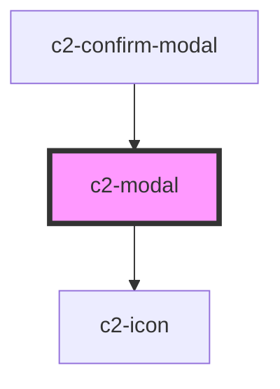

# c2-modal

<!-- Auto Generated Below -->


## Overview

A pop up modal for overlaying information, warnings and confirmations.
Traps focus within the modal, and returns focus to previous location when closed.
Pair with an [`c2-portal`](/components/components/portal) to open and close.

## Usage

### Example

```tsx
const token = 'abc-123-cde';

export default () => (
    <c2-modal role={'alert'}>
        <h2 slot={'header'}>{'Successfully created a new'}</h2>
        <h1 slot={'header'}>{'Refresh token'}</h1>
        <f2-text-input
            readonly
            class={'token'}
            placeholder={'token'}
            name={'token'}
            value={token}
            inputProps={{
                onFocus(e: FocusEvent) {
                    (e.target as HTMLInputElement).select();
                },
            }}
        >
            <c2-thinking-button
                defaultIcon={'copy'}
                text={'Copy'}
                action={(e) => {
                    e.preventDefault();
                    return navigator.clipboard.writeText(token);
                }}
                variant={'outline'}
                color={'secondary'}
            />
        </f2-text-input>
        <b class={'copy_warning'}>
            <c2-icon icon={'critical'} />
            {"Be sure to copy your new token. It won't be shown again."}
        </b>
        <c2-button variant={'filled'} color={'secondary'} slot={'footer'}>
            {'Done'}
        </c2-button>
    </c2-modal>
);
```

```css
.token {
    width: 100%;
    margin-bottom: 16px;
}

.copy_warning {
    display: flex;
    align-items: center;
}

.copy_warning c2-icon {
    margin-right: 15px;
}

.done_button {
    min-width: 100px;
}
```


## Properties

| Property | Attribute | Description                        | Type      | Default |
| -------- | --------- | ---------------------------------- | --------- | ------- |
| `footer` | `footer`  | If the modal should have a footer. | `boolean` | `true`  |
| `header` | `header`  | If the modal should have a header. | `boolean` | `true`  |


## Events

| Event          | Description                                    | Type                |
| -------------- | ---------------------------------------------- | ------------------- |
| `requestClose` | Triggers when the modal requests to be closed. | `CustomEvent<void>` |


## Slots

| Slot       | Description                                                                |
| ---------- | -------------------------------------------------------------------------- |
|            | Places components in the body.                                             |
| `"footer"` | Places components in the footer. Pass c2-button and c2-button-link.        |
| `"header"` | Places components in the header. Pass a h2 then a h1 for standard styling. |


## Shadow Parts

| Part       | Description      |
| ---------- | ---------------- |
| `"body"`   | The modal body   |
| `"footer"` | The modal footer |
| `"header"` | The modal header |


## Dependencies

### Used by

 - [c2-confirm-modal](../confirm-modal)

### Depends on

- [c2-icon](../../icon)

### Graph


----------------------------------------------


