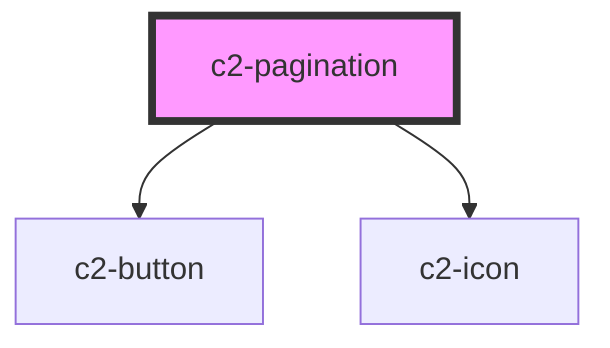

# c2-pagination

<!-- Auto Generated Below -->


## Overview

Page navigation with ability to jump to first and last pages with `pageCount` is provided.

## Usage

### Example

```tsx
import type { PageChangeEventType } from '@kurrent-ui/components';
import { createStore } from '@kurrent-ui/stores';

interface PageStore {
    current: number;
    pageCount: number;
}

const { state } = createStore<PageStore>({
    current: 1,
    pageCount: 20,
});

const handlePageChange = (e: CustomEvent<PageChangeEventType>) => {
    switch (e.detail) {
        case 'first':
            state.current = 1;
            break;
        case 'previous':
            state.current = state.current - 1;
            break;
        case 'next':
            state.current = state.current + 1;
            break;
        case 'last':
            state.current = state.pageCount;
            break;
    }
};

export default () => (
    <c2-pagination
        pageCount={state.pageCount}
        onUpdate={handlePageChange}
        current={state.current}
    />
);
```


## Properties

| Property               | Attribute    | Description      | Type                  | Default     |
| ---------------------- | ------------ | ---------------- | --------------------- | ----------- |
| `current` _(required)_ | `current`    | Current Page.    | `number`              | `undefined` |
| `pageCount`            | `page-count` | Number of pages. | `number \| undefined` | `undefined` |


## Events

| Event    | Description                                   | Type                                                     |
| -------- | --------------------------------------------- | -------------------------------------------------------- |
| `update` | Triggered when a pagination button is clicked | `CustomEvent<"first" \| "last" \| "next" \| "previous">` |


## Dependencies

### Depends on

- [c2-button](../buttons/button)
- [c2-icon](../icon)

### Graph


----------------------------------------------


