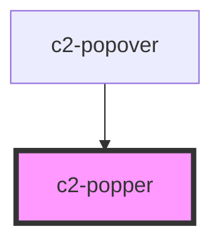

# c2-popper

<!-- Auto Generated Below -->

## Properties

| Property    | Attribute    | Description | Type      | Default |
| ----------- | ------------ | ----------- | --------- | ------- |
| `backdrop`  | `backdrop`   |             | `boolean` | `false` |
| `trapFocus` | `trap-focus` |             | `boolean` | `false` |

## Events

| Event          | Description | Type               |
| -------------- | ----------- | ------------------ |
| `requestClose` |             | `CustomEvent<any>` |

## Dependencies

### Used by

 - [c2-popover](../..)

### Graph

----------------------------------------------

