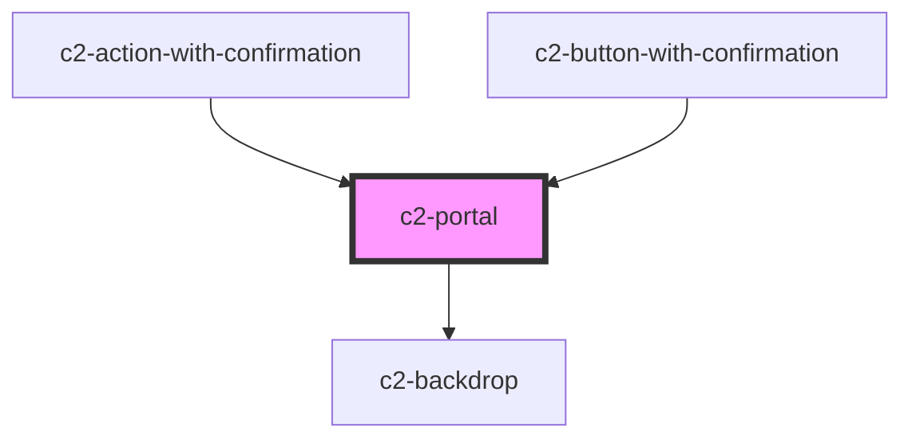

# c2-portal

<!-- Auto Generated Below -->


## Overview

Portals the passed node to a different part of the document. Note that portal does not transfer shadow scoped styles, unlike `c2-popover`, so any portaled elements should be self contained.

## Usage

### Example

```tsx
import type { FunctionalComponent } from '@stencil/core';
import { createStore } from '@kurrent-ui/stores';

const { state } = createStore<{ open: boolean }>({
    open: false,
});

export default () => (
    <>
        <c2-portal
            backdrop
            open={state.open}
            onRequestClose={requestClose}
            renderElement={(h) => <ExampleModal requestClose={requestClose} />}
        />
        <c2-button
            variant={'outline'}
            onClick={() => {
                state.open = true;
            }}
        >
            {'Open portal'}
        </c2-button>
    </>
);

const requestClose = () => {
    state.open = false;
};

const ExampleModal: FunctionalComponent<{ requestClose: () => void }> = ({
    requestClose,
}) => (
    <>
        <style>
            {`
                .important {
                    color: var(--color-error);
                }
            `}
        </style>
        <c2-modal role={'alert'}>
            <h2 slot={'header'}>{'Project name'}</h2>
            <h1 slot={'header'}>{'Production'}</h1>
            <p>
                {
                    'Deleting this project will delete all associated clusters and networks. This operation cannot be undone.'
                }
            </p>
            <p class={'important'}>
                {'Are you sure you want to proceed in deleting this project?'}
            </p>
            <c2-button
                variant={'cancel'}
                slot={'footer'}
                onClick={requestClose}
            >
                {'Cancel'}
            </c2-button>
            <c2-button
                variant={'delete'}
                slot={'footer'}
                onClick={requestClose}
            >
                {'Delete project'}
            </c2-button>
        </c2-modal>
    </>
);
```

```css
:host {
    display: flex;
    align-items: center;
    justify-content: center;
}
```


## Properties

| Property                     | Attribute            | Description                                                          | Type                                                  | Default     |
| ---------------------------- | -------------------- | -------------------------------------------------------------------- | ----------------------------------------------------- | ----------- |
| `backdrop`                   | `backdrop`           | If the portal should overlay a backdrop, to prevent external clicks. | `boolean`                                             | `false`     |
| `open`                       | `open`               | If the element is portaled or not.                                   | `boolean`                                             | `false`     |
| `preventOverscroll`          | `prevent-overscroll` | If the portal should prevent overscroll                              | `boolean`                                             | `false`     |
| `renderElement` _(required)_ | --                   | The element to render.                                               | `(h: typeof h) => string \| VNode \| VNode[] \| null` | `undefined` |
| `target`                     | `target`             | A query selector to select the location to portal to.                | `string`                                              | `'body'`    |


## Events

| Event          | Description                                  | Type               |
| -------------- | -------------------------------------------- | ------------------ |
| `requestClose` | Triggers when the popover requests to close. | `CustomEvent<any>` |


## Dependencies

### Used by

 - [c2-action-with-confirmation](../actions/action-with-confirmation)
 - [c2-button-with-confirmation](../buttons/button-with-confirmation)

### Depends on

- c2-backdrop

### Graph


----------------------------------------------


