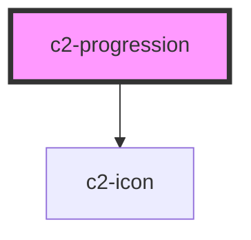

# c2-progression

<!-- Auto Generated Below -->


## Overview

A wizard progression bar.

## Usage

### Example

```tsx
import { createStore } from '@kurrent-ui/stores';

const { state } = createStore<{ location: string }>({
    location: '1-1',
});

export default () => (
    <c2-progression
        checkpoints={[
            {
                id: '1-1',
                title: 'Overworld',
            },
            {
                id: '1-2',
                title: 'Underground',
            },
            {
                id: '1-3',
                title: 'Athletic',
            },
            {
                id: '1-4',
                title: 'Castle',
            },
        ]}
        location={state.location}
        onProgressionRequest={(e) => {
            state.location = e.detail;
        }}
    />
);
```

```css
:host {
    display: flex;
    align-items: center;
    justify-content: center;
}
```


## Properties

| Property                   | Attribute  | Description                           | Type                                                                                                                                        | Default     |
| -------------------------- | ---------- | ------------------------------------- | ------------------------------------------------------------------------------------------------------------------------------------------- | ----------- |
| `checkpoints` _(required)_ | --         | A list of checkpoints to display.     | `Checkpoint[]`                                                                                                                              | `undefined` |
| `colors`                   | --         | Set custom colors for all checkpoints | `undefined \| { active?: string \| undefined; complete?: string \| undefined; inactive?: string \| undefined; }`                            | `undefined` |
| `icons`                    | --         | Set custom icons for all checkpoints  | `undefined \| { active?: IconDescription \| undefined; complete?: IconDescription \| undefined; inactive?: IconDescription \| undefined; }` | `undefined` |
| `location` _(required)_    | `location` | The current active location.          | `string`                                                                                                                                    | `undefined` |
| `readonly`                 | `readonly` | Disable interactivity.                | `boolean \| undefined`                                                                                                                      | `undefined` |


## Events

| Event                | Description                           | Type                  |
| -------------------- | ------------------------------------- | --------------------- |
| `progressionRequest` | Emitted when a checkpoint is clicked. | `CustomEvent<string>` |


## Shadow Parts

| Part           | Description                                 |
| -------------- | ------------------------------------------- |
| `"[state]"`    | The current state of the checkpoint button. |
| `"blob"`       | An indicator blob.                          |
| `"center"`     | A central icon in the indicator blob.       |
| `"checkpoint"` | A checkpoint button                         |
| `"connection"` | A connection between two checkpoints.       |


## Dependencies

### Depends on

- [c2-icon](../icon)

### Graph


----------------------------------------------


