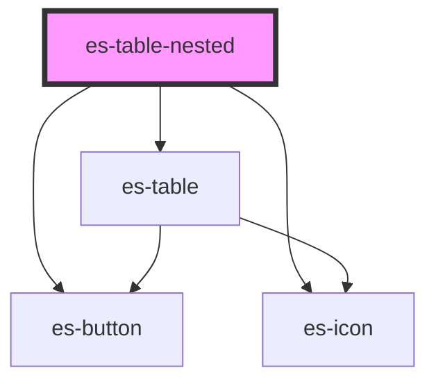

# es-table-nested

<!-- Auto Generated Below -->

## Overview

Create a nested table from data.

## Properties

| Property              | Attribute                | Description                                                                                                                                                                                                                                                                                           | Type                                                                        | Default                   |
| --------------------- | ------------------------ | ----------------------------------------------------------------------------------------------------------------------------------------------------------------------------------------------------------------------------------------------------------------------------------------------------- | --------------------------------------------------------------------------- | ------------------------- |
| `activePath`          | --                       | A path to a the currently active row, to auto expand its parent and show it as selected.                                                                                                                                                                                                              | `string[] \| undefined`                                                     | `undefined`               |
| `canExpand`           | --                       | Function to decide if a row can take expand, to show a nested table.                                                                                                                                                                                                                                  | `(key: string, data: any, depth: number) => boolean`                        | `() => true`              |
| `canExpandMore`       | --                       | Function to decide if a row can expand more, to show more rows in the nested table.                                                                                                                                                                                                                   | `(key: string, count: number) => boolean`                                   | `() =>         false`     |
| `cells` _(required)_  | --                       | A record of table cell definitions.Some built in cells are cells are available for use: - `--borderless`: A blank placeholder cell with no border, for aligning with the parent cell. - `--no-pad`: A blank placeholder cell, for aligning with the parent cell. - `--expander`: The expander button. | `{ [x: string]: TableCell<any, any>; }`                                     | `undefined`               |
| `columns`             | --                       | The order and keys of the cells to be rendered. If omitted, all cells will be rendered.                                                                                                                                                                                                               | `string[] \| undefined`                                                     | `Object.keys(this.cells)` |
| `defaultExpanded`     | --                       | Number of rows to be expanded by default                                                                                                                                                                                                                                                              | `((key: string, depth: number) => number) \| undefined`                     | `undefined`               |
| `expandBy`            | `expand-by`              | Number number of rows to display in expansion                                                                                                                                                                                                                                                         | `number`                                                                    | `10`                      |
| `extraCellProps`      | --                       | Pass extra props to cells                                                                                                                                                                                                                                                                             | `((key: string, data: any) => Record<string, any>) \| undefined`            | `undefined`               |
| `getCellData`         | --                       | Sync function for extracting the data from the row. By default, it assumes you passed an array of data as your columns.                                                                                                                                                                               | `((key: string) => any) \| undefined`                                       | `undefined`               |
| `getNestedCellData`   | --                       | Sync function for extracting the data from the nested row. By default, it assumes you passed an array of data as your columns.                                                                                                                                                                        | `((key: string) => any) \| undefined`                                       | `undefined`               |
| `getNestedRowKey`     | --                       | Sync function for extracting a key from your nested row data. By default, if the passed rows are strings it will use them directly, otherwise it will warn and use the index.                                                                                                                         | `((row: any, i: number) => string) \| undefined`                            | `undefined`               |
| `getNestedRows`       | --                       | Sync function for extracting a list of rows for the nested table                                                                                                                                                                                                                                      | `((key: string, count: number) => any[] \| undefined) \| undefined`         | `undefined`               |
| `getRowKey`           | --                       | Sync function for extracting a key from your row data. By default, if the passed rows are strings it will use them directly, otherwise it will warn and use the index.                                                                                                                                | `((row: any, i: number) => string) \| undefined`                            | `undefined`               |
| `headless`            | `headless`               | Do not render header.                                                                                                                                                                                                                                                                                 | `boolean`                                                                   | `false`                   |
| `linkRowTo`           | --                       | A function to calculate a href from the cell data.                                                                                                                                                                                                                                                    | `((row: any) => string) \| undefined`                                       | `undefined`               |
| `loadNested`          | --                       | async function for loading nested data when a row is expanded.                                                                                                                                                                                                                                        | `((key: string, data: any) => Promise<void>) \| undefined`                  | `undefined`               |
| `nestedColumns`       | --                       | The order and keys of the cells to be rendered in a nested table. If omitted, all cells will be rendered.                                                                                                                                                                                             | `string[] \| undefined`                                                     | `undefined`               |
| `nestedIdentifier`    | `nested-identifier`      | Passed to cell renderer as `parent`.                                                                                                                                                                                                                                                                  | `string`                                                                    | `'nested-table'`          |
| `nestedRowTakesFocus` | `nested-row-takes-focus` | If the nested rows should be allowed to take focus.                                                                                                                                                                                                                                                   | `boolean \| undefined`                                                      | `undefined`               |
| `outerIdentifier`     | `outer-identifier`       | Passed to cell renderer as `parent`.                                                                                                                                                                                                                                                                  | `string`                                                                    | `'table'`                 |
| `rowClass`            | --                       | A function to calculate the class or classes of the row from the cellData.                                                                                                                                                                                                                            | `(row: any, key: string) => string \| Record<string, boolean> \| undefined` | `() => undefined`         |
| `rowTakesFocus`       | `row-takes-focus`        | If rows should be allowed to take focus                                                                                                                                                                                                                                                               | `boolean \| undefined`                                                      | `undefined`               |
| `rows` _(required)_   | --                       | An array of rows to render. Each item in the array is passed to getCellData, to allow passing keys or other identifiers.                                                                                                                                                                              | `any[]`                                                                     | `undefined`               |
| `stickyHeader`        | `sticky-header`          | Header sticks to scroll parent.                                                                                                                                                                                                                                                                       | `boolean`                                                                   | `false`                   |
| `toggleRowOnClick`    | `toggle-row-on-click`    | If clicking a row should expand it.                                                                                                                                                                                                                                                                   | `boolean`                                                                   | `false`                   |

## Events

| Event       | Description                                                                                     | Type                                       |
| ----------- | ----------------------------------------------------------------------------------------------- | ------------------------------------------ |
| `clickRow`  | Triggered whenever a row (or nested row) is clicked. The `detail` is the item in the row array. | `CustomEvent<any>`                         |
| `expansion` | Triggered whenever a row is expanded.                                                           | `CustomEvent<{ data: any; key: string; }>` |

## Dependencies

### Depends on

- [es-table](../es-table)
- [es-button](../../buttons/es-button)
- [es-icon](../../es-icon)

### Graph

----------------------------------------------

