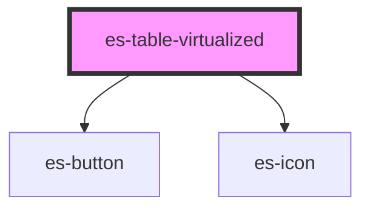

# es-table-virtualized

<!-- Auto Generated Below -->

## Properties

| Property                   | Attribute         | Description                                                                                                             | Type                                                                                       | Default               |
| -------------------------- | ----------------- | ----------------------------------------------------------------------------------------------------------------------- | ------------------------------------------------------------------------------------------ | --------------------- |
| `afterHeight`              | `after-height`    | The height (in pixels) of the after                                                                                     | `number`                                                                                   | `0`                   |
| `beforeHeight`             | `before-height`   | The height (in pixels) of the before                                                                                    | `number`                                                                                   | `0`                   |
| `blockSize`                | --                | Groups rows into blocks                                                                                                 | `bigint`                                                                                   | `10n`                 |
| `cells` _(required)_       | --                | A record of table cell definitions.                                                                                     | `{ [x: string]: TableCell<any>; }`                                                         | `undefined`           |
| `columns`                  | --                | The order and keys of the cells to be rendered. If omitted, all cells will be rendered.                                 | `string[] \| undefined`                                                                    | `undefined`           |
| `getCellData` _(required)_ | --                | Sync function for extracting the data from the row. By default, it assumes you passed an array of data as your columns. | `(key: string, index: bigint) => any`                                                      | `undefined`           |
| `getKeyFromIndex`          | --                | Sync function for converting an index into a key                                                                        | `(index: bigint) => string`                                                                | `(i) => `${i}``       |
| `headerHeight`             | `header-height`   | The height (in pixels) of the header                                                                                    | `number`                                                                                   | `this.rowHeight`      |
| `headless`                 | `headless`        | Do not render header.                                                                                                   | `boolean`                                                                                  | `false`               |
| `identifier`               | `identifier`      | Passed to cell renderer as `parent`.                                                                                    | `string`                                                                                   | `'table-virtualized'` |
| `linkRowTo`                | --                | A function to calculate a href from the cell data.                                                                      | `((row: any) => string) \| undefined`                                                      | `undefined`           |
| `reflowSize`               | --                | The size of the grid rows before starting a reflow                                                                      | `bigint`                                                                                   | `1000n`               |
| `renderAfter`              | --                | Display in a row after the last row                                                                                     | `() => VNode \| null`                                                                      | `() => null`          |
| `renderBefore`             | --                | Display in a row before the first row                                                                                   | `() => VNode \| null`                                                                      | `() => null`          |
| `rowClass`                 | --                | A function to calculate the class or classes of the row from the cellData.                                              | `(row: any, key: string, index: bigint) => string \| Record<string, boolean> \| undefined` | `() => undefined`     |
| `rowCount` _(required)_    | --                | The total number of rows                                                                                                | `bigint`                                                                                   | `undefined`           |
| `rowHeight`                | `row-height`      | The height (in pixels) of the row                                                                                       | `number`                                                                                   | `50`                  |
| `rowTakesFocus`            | `row-takes-focus` | If rows should be allowed to take focus                                                                                 | `boolean \| undefined`                                                                     | `undefined`           |
| `scrollLock`               | `scroll-lock`     | If the table should lock scroll on appending events                                                                     | `boolean \| undefined`                                                                     | `undefined`           |
| `sort`                     | --                | How the table is sorted                                                                                                 | `[key: string, order: SortOrder] \| undefined`                                             | `undefined`           |
| `stickyHeader`             | `sticky-header`   | Header sticks to scroll parent.                                                                                         | `boolean`                                                                                  | `true`                |
| `windowSize`               | --                | The size of the window to render                                                                                        | `bigint`                                                                                   | `100n`                |

## Events

| Event         | Description                                                                     | Type                         |
| ------------- | ------------------------------------------------------------------------------- | ---------------------------- |
| `clickRow`    | Triggered whenever a row is clicked. The `detail` is the item in the row array. | `CustomEvent<ClickRow<any>>` |
| `clickSort`   | Triggered whenever a sortable header is clicked                                 | `CustomEvent<string>`        |
| `firstWindow` | Triggered when the first window is scrolled to                                  | `CustomEvent<void>`          |
| `lastWindow`  | Triggered when the last window is scrolled to                                   | `CustomEvent<void>`          |
| `loadWindow`  | Triggered when a window is rendered                                             | `CustomEvent<LoadWindow>`    |

## Methods

### `jumpToRow(index: bigint, { highlight, smooth }?: Partial<JumpOptions>) => Promise<void>`

Jump to the passed row, with smooth scroll and highlight, if specified.

#### Returns

Type: `Promise<void>`

## Dependencies

### Depends on

- [es-button](../../buttons/es-button)
- [es-icon](../../es-icon)

### Graph

----------------------------------------------

