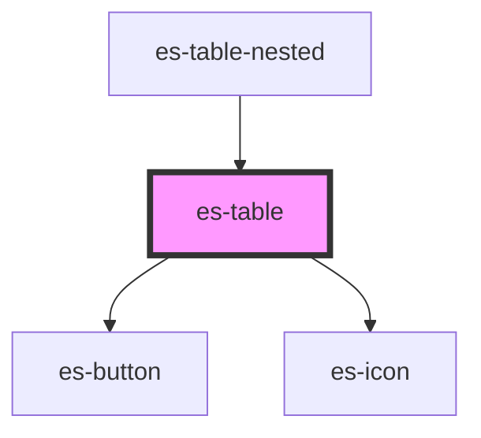

# es-table


<!-- Auto Generated Below -->


## Usage

### Example

```tsx
import { iconDetails, IconDetail } from 'helpers';
import { TableCells, toast } from '@eventstore-ui/components';

const tableCells: TableCells<IconDetail> = {
    name: {
        title: 'Name',
    },
    usage: {
        title: 'Usage',
        cell: (h, { data: { name } }) => (
            <pre style={{ margin: 0 }}>{`<es-icon icon={'${name}'} />`}</pre>
        ),
    },
    icon: {
        title: '',
        variant: 'no-pad',
        cell: (h, { data: { name } }) => <es-icon icon={name} />,
    },
};

const onClickRow = (e: CustomEvent<IconDetail>) => {
    const icon = e.detail;
    toast.success({
        title: 'Clicked row',
        message: `You clicked ${icon.name}.`,
        icon: icon.name,
    });
};

export default () => (
    <es-table
        cells={tableCells}
        rows={Object.values(iconDetails)}
        onClickRow={onClickRow}
    />
);
```

```css
:host {
    padding: 0;
}

*[role='row'] {
    cursor: pointer;
    transition: color 500ms ease;
}

*[role='row']:hover {
    color: var(--color-secondary);
}
```


## Properties

| Property             | Attribute         | Description                                                                                                              | Type                                                                        | Default           |
| -------------------- | ----------------- | ------------------------------------------------------------------------------------------------------------------------ | --------------------------------------------------------------------------- | ----------------- |
| `cells` _(required)_ | --                | A record of table cell definitions.                                                                                      | `{ [x: string]: TableCell<any, any>; }`                                     | `undefined`       |
| `columns`            | --                | The order and keys of the cells to be rendered. If omitted, all cells will be rendered.                                  | `string[] \| undefined`                                                     | `undefined`       |
| `extraCellProps`     | --                | Pass extra props to cells                                                                                                | `((key: string, data: any) => Record<string, any>) \| undefined`            | `undefined`       |
| `getCellData`        | --                | Sync function for extracting the data from the row. By default, it assumes you passed an array of data as your columns.  | `(key: string) => any`                                                      | `(d) => d`        |
| `headless`           | `headless`        | Do not render header.                                                                                                    | `boolean`                                                                   | `false`           |
| `identifier`         | `identifier`      | Passed to cell renderer as `parent`.                                                                                     | `string`                                                                    | `'table'`         |
| `linkRowTo`          | --                | A function to calculate a href from the cell data.                                                                       | `((row: any) => string) \| undefined`                                       | `undefined`       |
| `renderExpansion`    | --                | Allows rendering a node after the row.                                                                                   | `(h: typeof h, key: string) => string \| VNode \| VNode[] \| null`          | `() => null`      |
| `rowClass`           | --                | A function to calculate the class or classes of the row from the cellData.                                               | `(row: any, key: string) => string \| Record<string, boolean> \| undefined` | `() => undefined` |
| `rowTakesFocus`      | `row-takes-focus` | If rows should be allowed to take focus                                                                                  | `boolean \| undefined`                                                      | `undefined`       |
| `rows` _(required)_  | --                | An array of rows to render. Each item in the array is passed to getCellData, to allow passing keys or other identifiers. | `any[]`                                                                     | `undefined`       |
| `sort`               | --                | How the table is sorted                                                                                                  | `[key: string, order: SortOrder] \| undefined`                              | `undefined`       |
| `stickyHeader`       | `sticky-header`   | Header sticks to scroll parent.                                                                                          | `boolean`                                                                   | `false`           |


## Events

| Event       | Description                                     | Type                         |
| ----------- | ----------------------------------------------- | ---------------------------- |
| `clickRow`  | Triggered whenever a row is clicked.            | `CustomEvent<ClickRow<any>>` |
| `clickSort` | Triggered whenever a sortable header is clicked | `CustomEvent<string>`        |


## Dependencies

### Used by

 - [es-table-nested](../es-table-nested)

### Depends on

- [es-button](../../buttons/es-button)
- [es-icon](../../es-icon)

### Graph


----------------------------------------------


