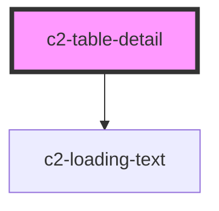

# c2-table-detail

<!-- Auto Generated Below -->


## Overview

Render a single row data as a grid of information.

## Usage

### Example

```tsx
import type { TableCells } from '@kurrent-ui/components';
import { iconDetails, type IconDetail } from 'utils/helpers';

const tableCells: TableCells<IconDetail> = {
    name: {
        title: 'Name',
    },
    icon: {
        title: 'Icon',
        cell: (h, { data: { name } }) => <c2-icon icon={name} />,
    },
    component: {
        title: 'Internal Name',
    },
    aliases: {
        title: 'Aliases',
        cell: (_, { data: { aliases } }) => aliases?.join(', ') ?? '-',
    },
    usage: {
        title: 'Usage',
        variant: 'full-width',
        cell: (h, { data: { name } }) => (
            <pre style={{ margin: '0' }}>{`<c2-icon icon={'${name}'} />`}</pre>
        ),
    },
};

export default () => (
    <c2-table-detail cells={tableCells} data={iconDetails['spinner']} />
);
```

```css
:host {
    display: contents;
}
```


## Properties

| Property             | Attribute    | Description                                                                             | Type                                    | Default     |
| -------------------- | ------------ | --------------------------------------------------------------------------------------- | --------------------------------------- | ----------- |
| `cells` _(required)_ | --           | A record of table cell definitions.                                                     | `{ [x: string]: TableCell<any, any>; }` | `undefined` |
| `columns`            | --           | The order and keys of the cells to be rendered. If omitted, all cells will be rendered. | `string[] \| undefined`                 | `undefined` |
| `data` _(required)_  | `data`       | The data to render.                                                                     | `any`                                   | `undefined` |
| `identifier`         | `identifier` | Passed to cell renderer as `parent`.                                                    | `string`                                | `'detail'`  |
| `loading`            | `loading`    | Indicates if the loading indicators should be displayed                                 | `boolean \| undefined`                  | `undefined` |


## CSS Custom Properties

| Name                 | Description                                                             |
| -------------------- | ----------------------------------------------------------------------- |
| `--column-gap`       | The gap between columns.                                                |
| `--grid-columns`     | Take full control of the grids column layout.                           |
| `--max-columns`      | The maximum number of columns.                                          |
| `--min-column-width` | The minimum width columns can be before reducing the number of columns. |
| `--row-gap`          | The gap between rows.                                                   |


## Dependencies

### Depends on

- [c2-loading-text](../../loading-text)

### Graph


----------------------------------------------


