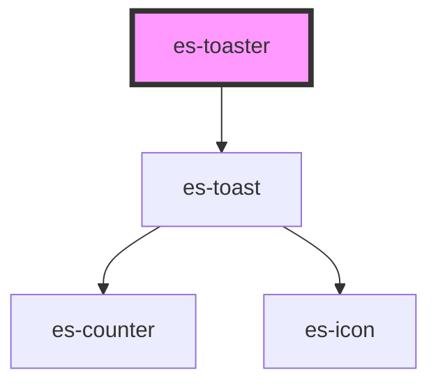

# es-toaster

<!-- Auto Generated Below -->

## Methods

### `popToast({ message, title, level, duration, icon, }: Bread) => Promise<void>`

#### Returns

Type: `Promise<void>`

## Dependencies

### Depends on

- [es-toast](.)

### Graph

----------------------------------------------

