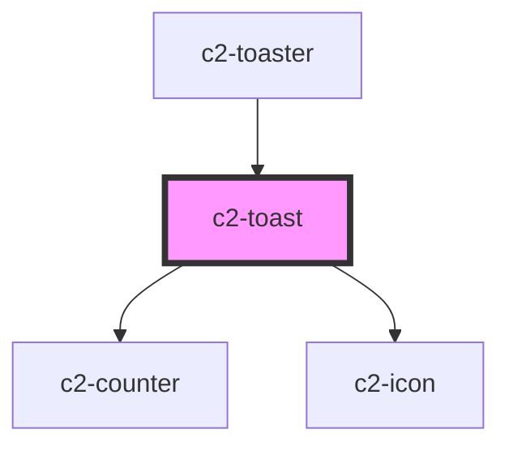

# c2-toast

<!-- Auto Generated Below -->

## Properties

| Property             | Attribute | Description | Type                                          | Default     |
| -------------------- | --------- | ----------- | --------------------------------------------- | ----------- |
| `count` _(required)_ | `count`   |             | `number`                                      | `undefined` |
| `icon` _(required)_  | `icon`    |             | `string`                                      | `undefined` |
| `level` _(required)_ | `level`   |             | `"error" \| "info" \| "success" \| "warning"` | `undefined` |

## Methods

### `close() => Promise<void>`

#### Returns

Type: `Promise<void>`

## Dependencies

### Used by

 - [c2-toaster](../c2-toaster)

### Depends on

- [c2-counter](../../c2-counter)
- [c2-icon](../../c2-icon)

### Graph

----------------------------------------------

