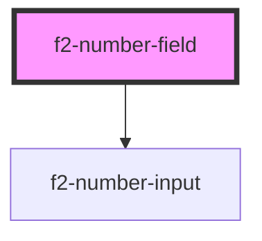

# f2-number-field


<!-- Auto Generated Below -->


## Overview

A number field.

## Usage

### Example

```tsx
import { createValidatedForm } from '@eventstore-ui/forms';

interface Example {
    count: string;
    mice: string;
}

const form = createValidatedForm<Example>({
    count: '',
    mice: {
        initialValue: '',
        validations: [
            {
                validator: (v) => parseInt(v, 10) >= 5,
                message: 'There are at least 5 mice.',
            },
        ],
    },
});

export default () => (
    <>
        <es-number-input
            label={'Count'}
            placeholder={'How high can you count'}
            unit={'n'}
            {...form.connect('count')}
        />
        <es-number-input
            label={'How many mice?'}
            placeholder={'Are there any?'}
            unit={'🐁'}
            {...form.connect('mice')}
        />
        <es-button
            slot={'footer'}
            onClick={() => {
                form.submit((data) => {
                    console.log(data);
                });
            }}
        >
            {'Submit'}
        </es-button>
    </>
);
```

```css
:host {
    display: flex;
    flex-direction: column;
    align-items: center;
    justify-content: center;
}

es-button {
    margin-left: auto;
}
```


## Properties

| Property                   | Attribute                 | Description                              | Type                                 | Default     |
| -------------------------- | ------------------------- | ---------------------------------------- | ------------------------------------ | ----------- |
| `disabled`                 | `disabled`                | If the input is disabled.                | `boolean \| undefined`               | `undefined` |
| `documentation`            | `documentation`           | Inline documentation text.               | `string \| undefined`                | `undefined` |
| `documentationLink`        | `documentation-link`      | Inline documentation link.               | `string \| undefined`                | `undefined` |
| `documentationLinkText`    | `documentation-link-text` | Inline documentation link text.          | `string \| undefined`                | `undefined` |
| `inputProps`               | --                        | Pass props directly to the input.        | `undefined \| { [x: string]: any; }` | `undefined` |
| `invalid`                  | `invalid`                 | If the field is currently invalid.       | `boolean \| undefined`               | `undefined` |
| `label` _(required)_       | `label`                   | The label of the field.                  | `string`                             | `undefined` |
| `messages`                 | --                        | The messages to display under the field. | `ValidationMessages \| undefined`    | `undefined` |
| `name` _(required)_        | `name`                    | The name of the input.                   | `string`                             | `undefined` |
| `placeholder` _(required)_ | `placeholder`             | The placeholder for the input.           | `string`                             | `undefined` |
| `readonly`                 | `readonly`                | If the input is editable.                | `boolean \| undefined`               | `undefined` |
| `unit`                     | `unit`                    | Display a unit beside the input.         | `string \| undefined`                | `undefined` |
| `value` _(required)_       | `value`                   | The current value of the field.          | `string`                             | `undefined` |


## Events

| Event         | Description                                     | Type                                       |
| ------------- | ----------------------------------------------- | ------------------------------------------ |
| `fieldchange` | Emitted when the value of the field is changed. | `CustomEvent<FieldChange<string, string>>` |


## Dependencies

### Depends on

- [f2-number-input](../input)

### Graph


----------------------------------------------


