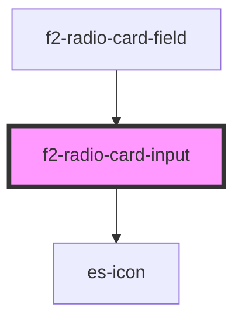

# f2-radio-card-input


<!-- Auto Generated Below -->


## Overview

A card based single select input.

## Usage

### Example

```tsx
import { createValidatedForm } from '@eventstore-ui/forms';
import type { AccordianSection } from '@eventstore-ui/components';
import type { RadioCardGroupOption } from '@eventstore-ui/fields';

interface Example {
    best: string | null;
    another: string | null;
}

const form = createValidatedForm<Example>({
    best: null,
    another: null,
});

export default () => (
    <es-accordian sections={sections}>
        <es-radio-card-group
            slot={'option_one'}
            labelledby={'option_one'}
            options={options}
            {...form.connect('best')}
        />
        <es-radio-card-group
            slot={'option_two'}
            labelledby={'option_two'}
            options={options}
            groupBy={'group'}
            {...form.connect('another')}
        />
        <es-button
            slot={'footer'}
            onClick={() => {
                form.submit((data) => {
                    console.log(data);
                });
            }}
        >
            {'Submit'}
        </es-button>
    </es-accordian>
);

const options: RadioCardGroupOption[] = [
    {
        value: 'a',
        name: 'The letter A',
        description: 'The first letter of the alphabet',
        group: 'Vowels',
    },
    {
        value: 'b',
        name: 'The letter B',
        description: 'The second letter of the alphabet',
        group: 'Consonants',
        disabled: true,
    },
    {
        value: 'c',
        name: 'The letter C',
        description: 'The third letter of the alphabet',
        group: 'Consonants',
    },
    {
        value: 'd',
        name: 'The letter D',
        description: 'A letter of the alphabet',
        group: 'Consonants',
    },
    {
        value: 'e',
        name: 'The letter E',
        description: 'A letter of the alphabet',
        group: 'Vowels',
    },
    {
        value: 'f',
        name: 'The letter F',
        description: 'A letter of the alphabet',
        group: 'Consonants',
    },
];

const sections: AccordianSection[] = [
    {
        name: 'option_one',
        title: 'Options 1',
        variant: 'field',
    },
    {
        name: 'option_two',
        title: 'Grouped Options',
        variant: 'field',
    },
    {
        name: 'footer',
        title: '',
        variant: 'footer',
    },
];
```


## Properties

| Property               | Attribute    | Description                                  | Type                                                                                | Default                            |
| ---------------------- | ------------ | -------------------------------------------- | ----------------------------------------------------------------------------------- | ---------------------------------- |
| `checkIcon`            | `check-icon` | Icon to display when checked.                | `[namespace: string \| symbol, name: string] \| string`                             | `[ICON_NAMESPACE, 'check']`        |
| `disabled`             | `disabled`   | If the input is disabled.                    | `boolean \| undefined`                                                              | `undefined`                        |
| `groupBy`              | `group-by`   | Group the cards by a key.                    | `string \| undefined`                                                               | `undefined`                        |
| `invalid`              | `invalid`    | If the input is currently in an error state. | `boolean`                                                                           | `false`                            |
| `name` _(required)_    | `name`       | The name of the input.                       | `string`                                                                            | `undefined`                        |
| `options` _(required)_ | --           | The options to be displayed and chosen from. | `RadioCardOption[]`                                                                 | `undefined`                        |
| `renderCard`           | --           | Overwrite the default card renderer          | `(h: typeof h, option: any, active: boolean) => string \| VNode \| VNode[] \| null` | `RadioCardInput.defaultRenderCard` |
| `value` _(required)_   | `value`      | The current value of the input.              | `null \| string`                                                                    | `undefined`                        |


## Events

| Event         | Description                                     | Type                                       |
| ------------- | ----------------------------------------------- | ------------------------------------------ |
| `fieldchange` | Emitted when the value of the field is changed. | `CustomEvent<FieldChange<string, string>>` |


## Shadow Parts

| Part            | Description                |
| --------------- | -------------------------- |
| `"group-title"` | The title of a card group. |


## Dependencies

### Used by

 - [f2-radio-card-field](../field)

### Depends on

- es-icon

### Graph


----------------------------------------------


