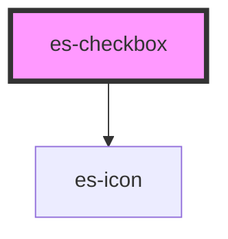

# es-checkbox


<!-- Auto Generated Below -->


## Usage

### Example

```tsx
import { createWorkingData } from '@eventstore/fields';

interface Example {
    enabled: boolean;
}

const workingData = createWorkingData<Example>({
    enabled: false,
});

export default () => (
    <es-checkbox {...workingData.connect('enabled')}>
        {'I agree to the terms and conditions?'}
    </es-checkbox>
);
```

```css
:host {
    display: flex;
    flex-direction: column;
    align-items: center;
    justify-content: center;
}
```


## Properties

| Property             | Attribute  | Description                                  | Type                                                    | Default                |
| -------------------- | ---------- | -------------------------------------------- | ------------------------------------------------------- | ---------------------- |
| `disabled`           | `disabled` | If the field is disabled.                    | `boolean \| undefined`                                  | `undefined`            |
| `icon`               | `icon`     | The icon to use.                             | `[namespace: string \| symbol, name: string] \| string` | `[ES_FIELDS, 'check']` |
| `invalid`            | `invalid`  | If the field is currently in an error state. | `boolean \| undefined`                                  | `undefined`            |
| `name` _(required)_  | `name`     | The name of the field.                       | `string`                                                | `undefined`            |
| `readonly`           | `readonly` | If the field is editable.                    | `boolean \| undefined`                                  | `undefined`            |
| `value` _(required)_ | `value`    | The current value of the field.              | `boolean`                                               | `undefined`            |


## Events

| Event         | Description                                     | Type               |
| ------------- | ----------------------------------------------- | ------------------ |
| `fieldchange` | Emitted when the value of the field is changed. | `CustomEvent<any>` |


## CSS Custom Properties

| Name                   | Description       |
| ---------------------- | ----------------- |
| `--field-grid-columns` | The field layout. |


## Dependencies

### Depends on

- es-icon

### Graph


----------------------------------------------


