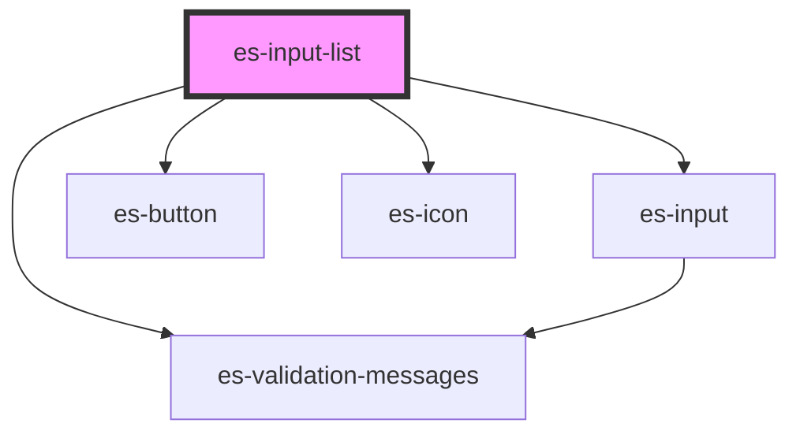

# es-list-creator

<!-- Auto Generated Below -->

## Properties

| Property                   | Attribute       | Description | Type                       | Default      |
| -------------------------- | --------------- | ----------- | -------------------------- | ------------ |
| `additionText`             | `addition-text` |             | `string`                   | `'Add item'` |
| `data` _(required)_        | --              |             | `WorkingDataArray<string>` | `undefined`  |
| `disabled`                 | `disabled`      |             | `boolean \| undefined`     | `undefined`  |
| `label` _(required)_       | `label`         |             | `string`                   | `undefined`  |
| `name` _(required)_        | `name`          |             | `string`                   | `undefined`  |
| `placeholder` _(required)_ | `placeholder`   |             | `string`                   | `undefined`  |

## Dependencies

### Depends on

- [es-input](../es-input)
- es-button
- es-icon
- [es-validation-messages](../es-validation-messages)

### Graph

----------------------------------------------

