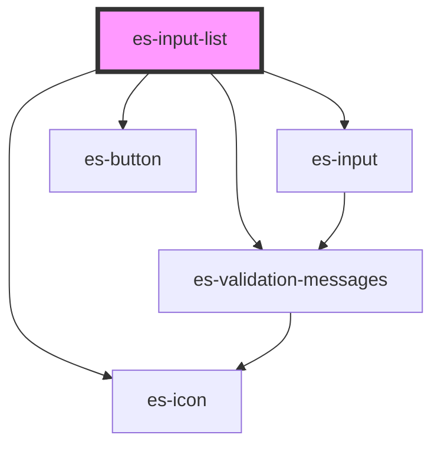

# es-list-creator


<!-- Auto Generated Below -->


## Usage

### Example

```tsx
import { createValidatedForm } from '@eventstore-ui/forms';

interface Example {
    names: string[];
}

const form = createValidatedForm<Example>({
    names: {
        initialValue: ['John', ''],
    },
});

export default () => (
    <es-input-list
        label={'Names'}
        placeholder={'Add a name to your list'}
        {...form.connect('names')}
    />
);
```

```css
:host {
    display: flex;
    flex-direction: column;
    align-items: center;
    justify-content: center;
}
```


## Properties

| Property                   | Attribute       | Description                          | Type                                                    | Default                     |
| -------------------------- | --------------- | ------------------------------------ | ------------------------------------------------------- | --------------------------- |
| `additionIcon`             | `addition-icon` | Icon for the add item button.        | `[namespace: string \| symbol, name: string] \| string` | `[ICON_NAMESPACE, 'plus']`  |
| `additionText`             | `addition-text` | Text for the add item button.        | `string`                                                | `'Add item'`                |
| `deleteIcon`               | `delete-icon`   | Icon for the delete button.          | `[namespace: string \| symbol, name: string] \| string` | `[ICON_NAMESPACE, 'trash']` |
| `disabled`                 | `disabled`      | If the input is disabled.            | `boolean \| undefined`                                  | `undefined`                 |
| `label` _(required)_       | `label`         | The label of the field.              | `string`                                                | `undefined`                 |
| `messages`                 | --              | The validation messages of the field | `ValidationMessages \| undefined`                       | `undefined`                 |
| `name` _(required)_        | `name`          | The name of the field.               | `string`                                                | `undefined`                 |
| `placeholder` _(required)_ | `placeholder`   | Display a placeholder in the input.  | `string`                                                | `undefined`                 |
| `value` _(required)_       | --              | The currently selected values        | `string[]`                                              | `undefined`                 |


## Events

| Event         | Description                                     | Type                                 |
| ------------- | ----------------------------------------------- | ------------------------------------ |
| `fieldchange` | Emitted when the value of the field is changed. | `CustomEvent<FieldChange<string[]>>` |


## CSS Custom Properties

| Name                   | Description       |
| ---------------------- | ----------------- |
| `--field-grid-columns` | The field layout. |


## Dependencies

### Depends on

- [es-input](../es-input)
- es-button
- es-icon
- [es-validation-messages](../es-validation-messages)

### Graph


----------------------------------------------


