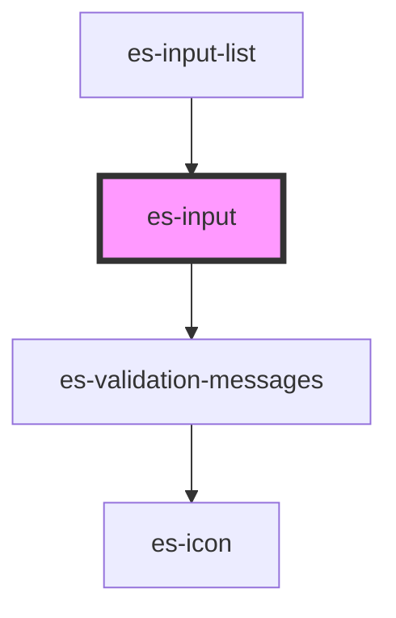

# es-input


<!-- Auto Generated Below -->


## Usage

### Example

```tsx
import { createValidatedForm } from '@eventstore/forms';

interface Example {
    text: string;
    id: string;
}

const forms = createValidatedForm<Example>({
    text: '',
    id: {
        initialValue: '',
        validations: [
            {
                validator: (v) => v.length === 12,
                message: 'Please provide a complete Id',
            },
        ],
    },
});

const onEnter = () => {
    forms.submit((data) => {
        console.log(data);
    });
};

export default () => (
    <>
        <es-input
            label={'Text'}
            placeholder={'Write some text'}
            onEnter={onEnter}
            {...forms.connect('text')}
        />
        <es-input
            label={'Account Id'}
            onEnter={onEnter}
            mask={{
                mask: '0000-0000-0000',
                unmask: true,
                lazy: false,
                placeholderChar: '_',
            }}
            {...forms.connect('id')}
        />
        <es-input
            disabled
            label={'Disabled'}
            placeholder={'This is disabled'}
            {...forms.connect('text')}
        />
    </>
);
```

```css
:host {
    display: flex;
    flex-direction: column;
    align-items: center;
    justify-content: center;
}
```


## Properties

| Property                   | Attribute     | Description                                  | Type                                 | Default     |
| -------------------------- | ------------- | -------------------------------------------- | ------------------------------------ | ----------- |
| `disabled`                 | `disabled`    | If the field is disabled.                    | `boolean \| undefined`               | `undefined` |
| `inputProps`               | --            | Pass props directly to the input.            | `undefined \| { [x: string]: any; }` | `undefined` |
| `invalid`                  | `invalid`     | If the field is currently in an error state. | `boolean \| undefined`               | `undefined` |
| `label` _(required)_       | `label`       | The label of the field.                      | `string`                             | `undefined` |
| `mask`                     | --            | Apply an input mask                          | `MaskOptions \| undefined`           | `undefined` |
| `messages`                 | --            | The validation messages of the field         | `ValidationMessages \| undefined`    | `undefined` |
| `name` _(required)_        | `name`        | The name of the field.                       | `string`                             | `undefined` |
| `placeholder` _(required)_ | `placeholder` | The placeholder for the input.               | `string`                             | `undefined` |
| `readonly`                 | `readonly`    | If the field is editable.                    | `boolean \| undefined`               | `undefined` |
| `value` _(required)_       | `value`       | The current value of the field.              | `string`                             | `undefined` |


## Events

| Event         | Description                                              | Type                               |
| ------------- | -------------------------------------------------------- | ---------------------------------- |
| `enter`       | Emitted on keyup of enter, if no modifier keys are held. | `CustomEvent<any>`                 |
| `fieldchange` | Emitted when the value of the field is changed.          | `CustomEvent<FieldChange<string>>` |


## CSS Custom Properties

| Name                   | Description       |
| ---------------------- | ----------------- |
| `--field-grid-columns` | The field layout. |


## Dependencies

### Used by

 - [es-input-list](../es-input-list)

### Depends on

- [es-validation-messages](../es-validation-messages)

### Graph


----------------------------------------------


