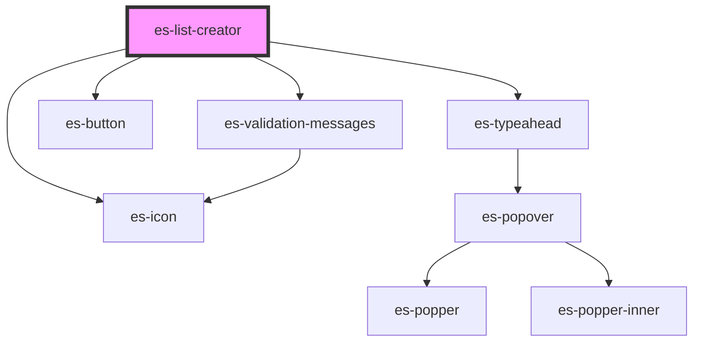

# es-list-creator


<!-- Auto Generated Below -->


## Overview

A list creator input.

## Usage

### Example

```tsx
import { createValidatedForm } from '@eventstore-ui/forms';

interface Example {
    names: string[];
}

const workingData = createValidatedForm<Example>({
    names: {
        initialValue: ['john'],
    },
});

const options = [
    { name: 'John', value: 'john' },
    { name: 'Nathanial', value: 'nathanial' },
];

export default () => (
    <es-list-creator
        label={'Names'}
        placeholder={'Add a name to your list'}
        options={options}
        {...workingData.connect('names')}
    />
);
```

```css
:host {
    display: flex;
    flex-direction: column;
    align-items: center;
    justify-content: center;
}
```


## Properties

| Property                   | Attribute     | Description                           | Type                                                                           | Default                                                                                                 |
| -------------------------- | ------------- | ------------------------------------- | ------------------------------------------------------------------------------ | ------------------------------------------------------------------------------------------------------- |
| `addIcon`                  | `add-icon`    | The icon to display next to the field | `[namespace: string \| symbol, name: string] \| string`                        | `[ICON_NAMESPACE, 'plus']`                                                                              |
| `deleteIcon`               | `delete-icon` | Icon for the delete button.           | `[namespace: string \| symbol, name: string] \| string`                        | `[ICON_NAMESPACE, 'trash']`                                                                             |
| `disabled`                 | `disabled`    | If the field is disabled.             | `boolean \| undefined`                                                         | `undefined`                                                                                             |
| `icon`                     | `icon`        | The icon to display next to the field | `[namespace: string \| symbol, name: string] \| string \| undefined`           | `undefined`                                                                                             |
| `label` _(required)_       | `label`       | The label of the field.               | `string`                                                                       | `undefined`                                                                                             |
| `messages`                 | --            | The validation messages of the field  | `ValidationMessages \| undefined`                                              | `undefined`                                                                                             |
| `name` _(required)_        | `name`        | The name of the field.                | `string`                                                                       | `undefined`                                                                                             |
| `options` _(required)_     | --            | A list of options to choose from.     | `TypeaheadOption[]`                                                            | `undefined`                                                                                             |
| `placeholder` _(required)_ | `placeholder` | The placeholder for the input.        | `string`                                                                       | `undefined`                                                                                             |
| `renderItem`               | --            | Render the list item.                 | `(h: typeof h, option: TypeaheadOption) => string \| VNode \| VNode[] \| null` | `(         h,         { name },     ) => <input readonly class={'input'} value={name} tabindex={-1} />` |
| `value` _(required)_       | --            | The selected item ids                 | `string[]`                                                                     | `undefined`                                                                                             |


## Events

| Event         | Description                                     | Type                                 |
| ------------- | ----------------------------------------------- | ------------------------------------ |
| `fieldchange` | Emitted when the value of the field is changed. | `CustomEvent<FieldChange<string[]>>` |


## Shadow Parts

| Part                | Description                              |
| ------------------- | ---------------------------------------- |
| `"value-list"`      | Target the ul containing the list items. |
| `"value-list-item"` | Target the li containing the option,     |


## CSS Custom Properties

| Name                   | Description       |
| ---------------------- | ----------------- |
| `--field-grid-columns` | The field layout. |


## Dependencies

### Depends on

- es-typeahead
- es-icon
- es-button
- [es-validation-messages](../es-validation-messages)

### Graph


----------------------------------------------


