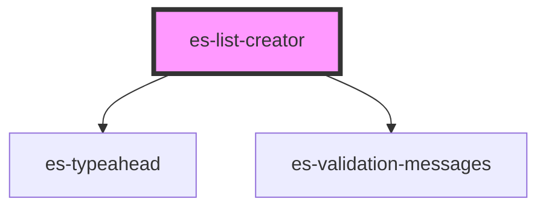

# es-list-creator

<!-- Auto Generated Below -->

## Properties

| Property                   | Attribute     | Description | Type                                                                   | Default                                                                                                               |
| -------------------------- | ------------- | ----------- | ---------------------------------------------------------------------- | --------------------------------------------------------------------------------------------------------------------- |
| `disabled`                 | `disabled`    |             | `boolean \| undefined`                                                 | `undefined`                                                                                                           |
| `icon` _(required)_        | `icon`        |             | `string`                                                               | `undefined`                                                                                                           |
| `invalid`                  | `invalid`     |             | `boolean \| undefined`                                                 | `undefined`                                                                                                           |
| `label` _(required)_       | `label`       |             | `string`                                                               | `undefined`                                                                                                           |
| `messages`                 | --            |             | `undefined \| { error: string[]; warning: string[]; info: string[]; }` | `undefined`                                                                                                           |
| `name` _(required)_        | `name`        |             | `string`                                                               | `undefined`                                                                                                           |
| `options` _(required)_     | --            |             | `TypeaheadOption[]`                                                    | `undefined`                                                                                                           |
| `placeholder` _(required)_ | `placeholder` |             | `string`                                                               | `undefined`                                                                                                           |
| `renderItem`               | --            |             | `({ name }: TypeaheadOption) => VNode`                                 | `({ name }: TypeaheadOption): VNode => (         <input readonly class={'input'} value={name} tabindex={-1} />     )` |
| `value` _(required)_       | --            |             | `string[]`                                                             | `undefined`                                                                                                           |

## Events

| Event         | Description | Type               |
| ------------- | ----------- | ------------------ |
| `fieldchange` |             | `CustomEvent<any>` |

## Dependencies

### Depends on

- [es-typeahead](../es-typeahead)
- [es-validation-messages](../es-validation-messages)

### Graph

----------------------------------------------

*Built with [StencilJS](https://stenciljs.com/)*
