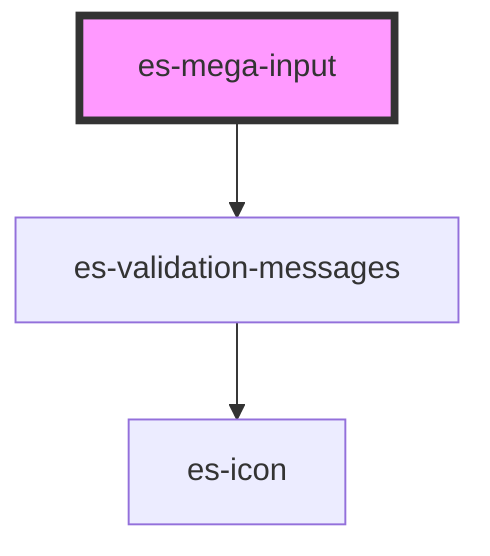

# es-mega-input


<!-- Auto Generated Below -->


## Overview

An extra large input.

## Usage

### Example

```tsx
import { createValidatedForm } from '@eventstore-ui/forms';

interface Example {
    text: string;
}

const form = createValidatedForm<Example>({
    text: '',
});

const sections = [
    {
        name: 'mega_example',
        title: '', // mega inputs are self labeled
        variant: 'mega',
    },
    {
        name: 'mega_disabled',
        title: '', // mega inputs are self labeled
        variant: 'mega',
    },
    {
        name: 'footer',
        title: '',
        variant: 'footer',
    },
];

export default () => (
    <es-accordian sections={sections}>
        <es-mega-input
            slot={'mega_example'}
            label={'Text'}
            placeholder={'Write some text'}
            {...form.connect('text')}
        />
        <es-mega-input
            disabled
            slot={'mega_disabled'}
            label={'Disabled'}
            placeholder={'This is disabled'}
            {...form.connect('text')}
        />
        <es-button
            slot={'footer'}
            onClick={() => {
                form.submit((data) => {
                    console.log(data);
                });
            }}
        >
            {'Submit'}
        </es-button>
    </es-accordian>
);
```


## Properties

| Property                   | Attribute     | Description                                  | Type                                 | Default     |
| -------------------------- | ------------- | -------------------------------------------- | ------------------------------------ | ----------- |
| `disabled`                 | `disabled`    | If the field is disabled.                    | `boolean \| undefined`               | `undefined` |
| `inputProps`               | --            | Pass props directly to the input.            | `undefined \| { [x: string]: any; }` | `undefined` |
| `invalid`                  | `invalid`     | If the field is currently in an error state. | `boolean \| undefined`               | `undefined` |
| `label` _(required)_       | `label`       | The label of the field.                      | `string`                             | `undefined` |
| `messages`                 | --            | The validation messages of the field         | `ValidationMessages \| undefined`    | `undefined` |
| `name` _(required)_        | `name`        | The name of the field.                       | `string`                             | `undefined` |
| `placeholder` _(required)_ | `placeholder` | The placeholder for the input.               | `string`                             | `undefined` |
| `readonly`                 | `readonly`    | If the field is editable.                    | `boolean \| undefined`               | `undefined` |
| `value` _(required)_       | `value`       | The current value of the field.              | `string`                             | `undefined` |


## Events

| Event         | Description                                              | Type                               |
| ------------- | -------------------------------------------------------- | ---------------------------------- |
| `enter`       | Emitted on keyup of enter, if no modifier keys are held. | `CustomEvent<any>`                 |
| `fieldchange` | Emitted when the value of the field is changed.          | `CustomEvent<FieldChange<string>>` |


## Dependencies

### Depends on

- [es-validation-messages](../es-validation-messages)

### Graph


----------------------------------------------


