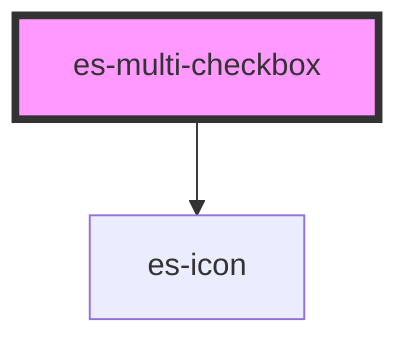

# es-multi-checkbox


<!-- Auto Generated Below -->


## Overview

A multi-checkbox component

## Usage

### Example

```tsx
import { createValidatedForm } from '@eventstore-ui/forms';

interface Example {
    options: Record<string, boolean>;
}

const form = createValidatedForm<Example>({
    options: {
        option1: false,
        option2: false,
        option3: false,
    },
});

export default () => (
    <es-multi-checkbox 
        {...form.connect('options')}
        options={[
            { label: 'Option 1', value: 'option1' },
            { label: 'Option 2', value: 'option2' },
            { label: 'Option 4', value: 'option4' },
            { label: 'Option 5', value: 'option5' },
            { label: 'Option 6', value: 'option6' },
            { label: 'Option 7', value: 'option7' },
            { label: 'Option 8', value: 'option8' },
            { label: 'Option 9', value: 'option9' },
            { label: 'Option 10', value: 'option10' },
            { label: 'Option 11', value: 'option11' },
            { label: 'Option 12', value: 'option12' },
            { label: 'Option 14', value: 'option14' },
            { label: 'Option 15', value: 'option15' },
            { label: 'Option 16', value: 'option16' },
            { label: 'Option 17', value: 'option17' },
            { label: 'Option 18', value: 'option18' },
            { label: 'Option 19', value: 'option19' },
        ]}
    />
);
```


## Properties

| Property            | Attribute  | Description                                  | Type                                                    | Default                     |
| ------------------- | ---------- | -------------------------------------------- | ------------------------------------------------------- | --------------------------- |
| `disabled`          | `disabled` | If the field is disabled.                    | `boolean \| undefined`                                  | `undefined`                 |
| `icon`              | `icon`     | The icon to use.                             | `[namespace: string \| symbol, name: string] \| string` | `[ICON_NAMESPACE, 'check']` |
| `invalid`           | `invalid`  | If the field is currently in an error state. | `boolean \| undefined`                                  | `undefined`                 |
| `name` _(required)_ | `name`     | The name of the field.                       | `string`                                                | `undefined`                 |
| `options`           | --         | The list of options for the checkboxes.      | `{ label: string; value: string; }[]`                   | `[]`                        |
| `readonly`          | `readonly` | If the field is editable.                    | `boolean \| undefined`                                  | `undefined`                 |
| `value`             | --         | The current value of the field.              | `{ [x: string]: boolean; }`                             | `{}`                        |


## Events

| Event         | Description                                     | Type                                                |
| ------------- | ----------------------------------------------- | --------------------------------------------------- |
| `fieldchange` | Emitted when the value of the field is changed. | `CustomEvent<FieldChange<Record<string, boolean>>>` |


## Dependencies

### Depends on

- es-icon

### Graph


----------------------------------------------


