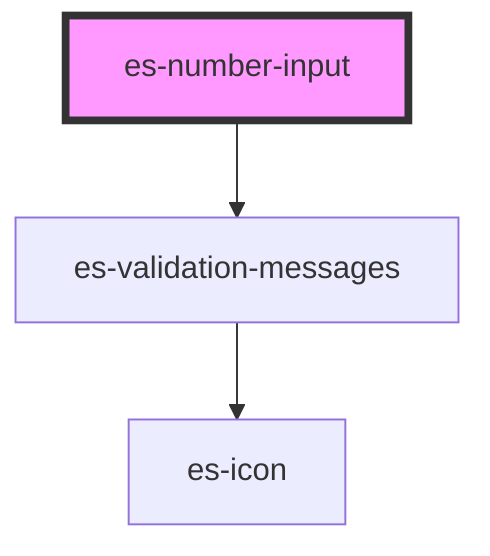

# es-number-input


<!-- Auto Generated Below -->


## Usage

### Example

```tsx
import { createValidatedForm } from '@eventstore-ui/forms';

interface Example {
    count: string;
    mice: string;
}

const form = createValidatedForm<Example>({
    count: '',
    mice: {
        initialValue: '',
        validations: [
            {
                validator: (v) => parseInt(v, 10) >= 5,
                message: 'There are at least 5 mice.',
            },
        ],
    },
});

const onEnter = () => {
    form.submit((data) => {
        console.log(data);
    });
};

export default () => (
    <>
        <es-number-input
            label={'Count'}
            placeholder={'How high can you count'}
            unit={'n'}
            {...form.connect('count')}
        />
        <es-number-input
            label={'How many mice?'}
            placeholder={'Are there any?'}
            unit={'🐁'}
            {...form.connect('mice')}
        />
        <es-button
            slot={'footer'}
            onClick={() => {
                form.submit((data) => {
                    console.log(data);
                });
            }}
        >
            {'Submit'}
        </es-button>
    </>
);
```

```css
:host {
    display: flex;
    flex-direction: column;
    align-items: center;
    justify-content: center;
}

es-button {
    margin-left: auto;
}
```


## Properties

| Property             | Attribute     | Description                                  | Type                                 | Default     |
| -------------------- | ------------- | -------------------------------------------- | ------------------------------------ | ----------- |
| `disabled`           | `disabled`    | If the field is disabled.                    | `boolean \| undefined`               | `undefined` |
| `inputProps`         | --            | Pass props directly to the input.            | `undefined \| { [x: string]: any; }` | `undefined` |
| `invalid`            | `invalid`     | If the field is currently in an error state. | `boolean \| undefined`               | `undefined` |
| `label` _(required)_ | `label`       | The label of the field.                      | `string`                             | `undefined` |
| `messages`           | --            | The validation messages of the field         | `ValidationMessages \| undefined`    | `undefined` |
| `name` _(required)_  | `name`        | The name of the field.                       | `string`                             | `undefined` |
| `placeholder`        | `placeholder` | The placeholder for the input.               | `string \| undefined`                | `undefined` |
| `readonly`           | `readonly`    | If the field is editable.                    | `boolean \| undefined`               | `undefined` |
| `unit`               | `unit`        | Display a unit beside the input.             | `string \| undefined`                | `undefined` |
| `value` _(required)_ | `value`       | The current value of the field.              | `string`                             | `undefined` |


## Events

| Event         | Description                                              | Type                               |
| ------------- | -------------------------------------------------------- | ---------------------------------- |
| `enter`       | Emitted on keyup of enter, if no modifier keys are held. | `CustomEvent<any>`                 |
| `fieldchange` | Emitted when the value of the field is changed.          | `CustomEvent<FieldChange<string>>` |


## CSS Custom Properties

| Name                   | Description       |
| ---------------------- | ----------------- |
| `--field-grid-columns` | The field layout. |


## Dependencies

### Depends on

- [es-validation-messages](../es-validation-messages)

### Graph


----------------------------------------------


