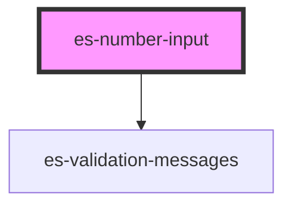

# es-number-input

<!-- Auto Generated Below -->

## Properties

| Property             | Attribute     | Description | Type                                                                   | Default     |
| -------------------- | ------------- | ----------- | ---------------------------------------------------------------------- | ----------- |
| `disabled`           | `disabled`    |             | `boolean \| undefined`                                                 | `undefined` |
| `inputProps`         | --            |             | `undefined \| { [x: string]: any; }`                                   | `undefined` |
| `invalid`            | `invalid`     |             | `boolean \| undefined`                                                 | `undefined` |
| `label` _(required)_ | `label`       |             | `string`                                                               | `undefined` |
| `messages`           | --            |             | `undefined \| { error: string[]; warning: string[]; info: string[]; }` | `undefined` |
| `name` _(required)_  | `name`        |             | `string`                                                               | `undefined` |
| `placeholder`        | `placeholder` |             | `string \| undefined`                                                  | `undefined` |
| `readonly`           | `readonly`    |             | `boolean \| undefined`                                                 | `undefined` |
| `unit`               | `unit`        |             | `string \| undefined`                                                  | `undefined` |
| `value` _(required)_ | `value`       |             | `string`                                                               | `undefined` |

## Events

| Event         | Description | Type               |
| ------------- | ----------- | ------------------ |
| `enter`       |             | `CustomEvent<any>` |
| `fieldchange` |             | `CustomEvent<any>` |

## Dependencies

### Depends on

- [es-validation-messages](../es-validation-messages)

### Graph

----------------------------------------------

