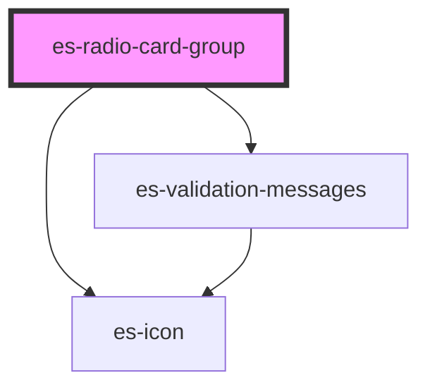

# es-radio-card-group


<!-- Auto Generated Below -->


## Usage

### Example

```tsx
import { createWorkingData } from '@eventstore/fields';

interface Example {
    best: string | null;
    another: string | null;
}

const workingData = createWorkingData<Example>({
    best: null,
    another: null,
});

export default () => (
    <es-accordian sections={sections}>
        <es-radio-card-group
            slot={'option_one'}
            labelledby={'option_one'}
            options={options}
            {...workingData.connect('best')}
        />
        <es-radio-card-group
            slot={'option_two'}
            labelledby={'option_two'}
            options={options}
            groupBy={'group'}
            {...workingData.connect('another')}
        />
        <es-button
            slot={'footer'}
            onClick={() => {
                workingData.submit((data) => {
                    console.log(data);
                });
            }}
        >
            {'Submit'}
        </es-button>
    </es-accordian>
);

const options = [
    {
        id: 'a',
        name: 'The letter A',
        description: 'The first letter of the alphabet',
        group: 'Vowels',
    },
    {
        id: 'b',
        name: 'The letter B',
        description: 'The second letter of the alphabet',
        group: 'Consonants',
        disabled: true,
    },
    {
        id: 'c',
        name: 'The letter C',
        description: 'The third letter of the alphabet',
        group: 'Consonants',
    },
    {
        id: 'd',
        name: 'The letter D',
        description: 'A letter of the alphabet',
        group: 'Consonants',
    },
    {
        id: 'e',
        name: 'The letter E',
        description: 'A letter of the alphabet',
        group: 'Vowels',
    },
    {
        id: 'f',
        name: 'The letter F',
        description: 'A letter of the alphabet',
        group: 'Consonants',
    },
];

const sections = [
    {
        name: 'option_one',
        title: 'Options 1',
        variant: 'field',
    },
    {
        name: 'option_two',
        title: 'Grouped Options',
        variant: 'field',
    },
    {
        name: 'footer',
        title: '',
        variant: 'footer',
    },
];
```


## Properties

| Property                  | Attribute         | Description                                                                                                                                | Type                                                    | Default                            |
| ------------------------- | ----------------- | ------------------------------------------------------------------------------------------------------------------------------------------ | ------------------------------------------------------- | ---------------------------------- |
| `groupBy`                 | `group-by`        | Group the cards by a key.                                                                                                                  | `string \| undefined`                                   | `undefined`                        |
| `icon`                    | `icon`            | Icon to display when checked.                                                                                                              | `[namespace: string \| symbol, name: string] \| string` | `[ES_FIELDS, 'check']`             |
| `invalid`                 | `invalid`         | If the field is currently in an error state.                                                                                               | `boolean`                                               | `false`                            |
| `labelledby` _(required)_ | `aria-labelledby` | The id of the component that labels this input. This input doesn't bring its own label, so must be labeled externally and referenced here. | `string`                                                | `undefined`                        |
| `messages`                | --                | The validation messages of the field                                                                                                       | `ValidationMessages \| undefined`                       | `undefined`                        |
| `name` _(required)_       | `name`            | The name of the field.                                                                                                                     | `string`                                                | `undefined`                        |
| `options` _(required)_    | --                | The options to be displayed and chosen from.                                                                                               | `RadioCardGroupOption[]`                                | `undefined`                        |
| `renderCard`              | --                | Overwrite the default card renderer                                                                                                        | `(option: any, active: boolean) => VNode \| VNode[]`    | `RadioCardGroup.defaultRenderCard` |
| `value` _(required)_      | `value`           | The current value of the field.                                                                                                            | `null \| string`                                        | `undefined`                        |


## Events

| Event         | Description                                     | Type                                       |
| ------------- | ----------------------------------------------- | ------------------------------------------ |
| `fieldchange` | Emitted when the value of the field is changed. | `CustomEvent<FieldChange<string \| null>>` |


## Shadow Parts

| Part            | Description                |
| --------------- | -------------------------- |
| `"group-title"` | The title of a card group. |


## Dependencies

### Depends on

- es-icon
- [es-validation-messages](../es-validation-messages)

### Graph


----------------------------------------------


