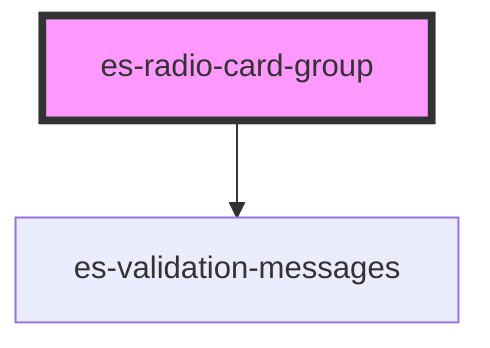

# es-radio-card-group

<!-- Auto Generated Below -->

## Properties

| Property                  | Attribute         | Description | Type                                                                   | Default                            |
| ------------------------- | ----------------- | ----------- | ---------------------------------------------------------------------- | ---------------------------------- |
| `invalid`                 | `invalid`         |             | `boolean`                                                              | `false`                            |
| `labelledby` _(required)_ | `aria-labelledby` |             | `string`                                                               | `undefined`                        |
| `messages`                | --                |             | `undefined \| { error: string[]; warning: string[]; info: string[]; }` | `undefined`                        |
| `name` _(required)_       | `name`            |             | `string`                                                               | `undefined`                        |
| `options` _(required)_    | --                |             | `RadioCardGroupOption[]`                                               | `undefined`                        |
| `renderCard`              | --                |             | `(option: any, active: boolean) => VNode \| VNode[]`                   | `RadioCardGroup.defaultRenderCard` |
| `value` _(required)_      | `value`           |             | `null \| string`                                                       | `undefined`                        |

## Events

| Event         | Description | Type               |
| ------------- | ----------- | ------------------ |
| `fieldchange` |             | `CustomEvent<any>` |

## Dependencies

### Depends on

- [es-validation-messages](../es-validation-messages)

### Graph

----------------------------------------------

*Built with [StencilJS](https://stenciljs.com/)*
