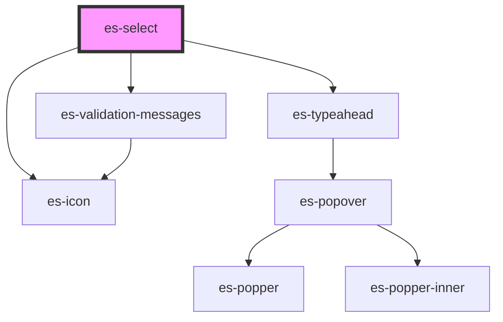

# es-select


<!-- Auto Generated Below -->


## Usage

### Example

```tsx
import { createValidatedForm } from '@eventstore/forms';

interface Example {
    names: string | null;
}

const form = createValidatedForm<Example>({
    name: null,
});

const options = [
    { name: 'Jim', value: 'jim' },
    { name: 'John', value: 'john' },
    { name: 'Nathanial', value: 'nathanial' },
];

export default () => (
    <>
        <es-select
            label={'Name'}
            placeholder={'Choose a name from the list'}
            options={options}
            {...form.connect('name')}
        />
        <es-select
            disabled
            label={'Disabled'}
            placeholder={'Choose a name from the list'}
            options={options}
            {...form.connect('name')}
        />
    </>
);
```

```css
:host {
    display: flex;
    flex-direction: column;
    align-items: center;
    justify-content: center;
}
```


## Properties

| Property               | Attribute      | Description                                  | Type                                                                                      | Default                  |
| ---------------------- | -------------- | -------------------------------------------- | ----------------------------------------------------------------------------------------- | ------------------------ |
| `chevronIcon`          | `chevron-icon` | Icon to use as a chevron.                    | `[namespace: string \| symbol, name: string] \| string`                                   | `[ES_FIELDS, 'chevron']` |
| `disabled`             | `disabled`     | If the field is disabled.                    | `boolean \| undefined`                                                                    | `undefined`              |
| `invalid`              | `invalid`      | If the field is currently in an error state. | `boolean \| undefined`                                                                    | `undefined`              |
| `label` _(required)_   | `label`        | The label of the field.                      | `string`                                                                                  | `undefined`              |
| `messages`             | --             | The validation messages of the field         | `ValidationMessages \| undefined`                                                         | `undefined`              |
| `name` _(required)_    | `name`         | The name of the field.                       | `string`                                                                                  | `undefined`              |
| `optionFilter`         | --             | Pass a custom search filter function         | `((filter: string, option: TypeaheadOption) => boolean) \| undefined`                     | `undefined`              |
| `options` _(required)_ | --             | A list of options to choose from.            | `TypeaheadOption[]`                                                                       | `undefined`              |
| `placeholder`          | `placeholder`  | The placeholder for the input.               | `string \| undefined`                                                                     | `undefined`              |
| `readonly`             | `readonly`     | If the field is editable.                    | `boolean \| undefined`                                                                    | `undefined`              |
| `renderOption`         | --             | Overwrite the default option renderer.       | `((option: TypeaheadOption, chosen: boolean) => string \| VNode \| VNode[]) \| undefined` | `undefined`              |
| `renderValue`          | --             | Overwrite the default value renderer.        | `(value: TypeaheadOption \| undefined, rawValue: string) => string \| VNode`              | `(o, v) => o?.name ?? v` |
| `value` _(required)_   | `value`        | The current value of the field.              | `null \| string`                                                                          | `undefined`              |


## Events

| Event         | Description                                     | Type                                       |
| ------------- | ----------------------------------------------- | ------------------------------------------ |
| `fieldchange` | Emitted when the value of the field is changed. | `CustomEvent<FieldChange<string \| null>>` |


## Shadow Parts

| Part           | Description                    |
| -------------- | ------------------------------ |
| `"input"`      | The wrapping div of the input. |
| `"true_input"` | The input element.             |


## Dependencies

### Depends on

- es-icon
- es-typeahead
- [es-validation-messages](../es-validation-messages)

### Graph


----------------------------------------------


