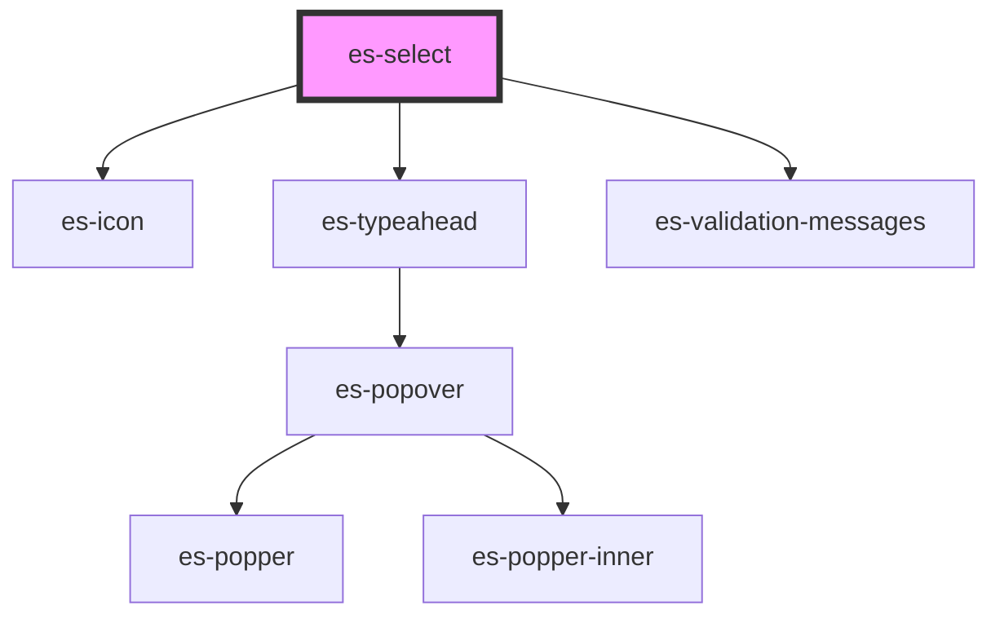

# es-select

<!-- Auto Generated Below -->

## Properties

| Property               | Attribute     | Description | Type                                                                                      | Default                  |
| ---------------------- | ------------- | ----------- | ----------------------------------------------------------------------------------------- | ------------------------ |
| `disabled`             | `disabled`    |             | `boolean \| undefined`                                                                    | `undefined`              |
| `invalid`              | `invalid`     |             | `boolean \| undefined`                                                                    | `undefined`              |
| `label` _(required)_   | `label`       |             | `string`                                                                                  | `undefined`              |
| `messages`             | --            |             | `undefined \| { error: string[]; warning: string[]; info: string[]; }`                    | `undefined`              |
| `name` _(required)_    | `name`        |             | `string`                                                                                  | `undefined`              |
| `optionFilter`         | --            |             | `((filter: string, option: TypeaheadOption) => boolean) \| undefined`                     | `undefined`              |
| `options` _(required)_ | --            |             | `TypeaheadOption[]`                                                                       | `undefined`              |
| `placeholder`          | `placeholder` |             | `string \| undefined`                                                                     | `undefined`              |
| `readonly`             | `readonly`    |             | `boolean \| undefined`                                                                    | `undefined`              |
| `renderOption`         | --            |             | `((option: TypeaheadOption, chosen: boolean) => string \| VNode \| VNode[]) \| undefined` | `undefined`              |
| `renderValue`          | --            |             | `(value: TypeaheadOption \| undefined, rawValue: string) => string \| VNode`              | `(o, v) => o?.name ?? v` |
| `value` _(required)_   | `value`       |             | `null \| string`                                                                          | `undefined`              |

## Events

| Event         | Description | Type               |
| ------------- | ----------- | ------------------ |
| `fieldchange` |             | `CustomEvent<any>` |

## Shadow Parts

| Part           | Description |
| -------------- | ----------- |
| `"input"`      |             |
| `"true_input"` |             |

## Dependencies

### Depends on

- es-icon
- [es-typeahead](../es-typeahead)
- [es-validation-messages](../es-validation-messages)

### Graph

----------------------------------------------

*Built with [StencilJS](https://stenciljs.com/)*
