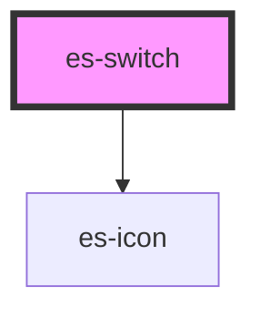

# es-switch


<!-- Auto Generated Below -->


## Usage

### Example

```tsx
import { createWorkingData } from '@eventstore/fields';

interface Example {
    good: boolean;
}

const workingData = createWorkingData<Example>({
    good: false,
});

export default () => (
    <>
        <es-switch label={'Text'} {...workingData.connect('good')} />
    </>
);
```

```css
:host {
    display: flex;
    flex-direction: column;
    align-items: center;
    justify-content: center;
}
```


## Properties

| Property             | Attribute  | Description                                  | Type                           | Default                    |
| -------------------- | ---------- | -------------------------------------------- | ------------------------------ | -------------------------- |
| `disabled`           | `disabled` | If the field is disabled.                    | `boolean \| undefined`         | `undefined`                |
| `invalid`            | `invalid`  | If the field is currently in an error state. | `boolean \| undefined`         | `undefined`                |
| `name` _(required)_  | `name`     | The name of the field.                       | `string`                       | `undefined`                |
| `readonly`           | `readonly` | If the field is editable.                    | `boolean \| undefined`         | `undefined`                |
| `text`               | --         | Text to display in high contrast mode.       | `{ on: string; off: string; }` | `{ on: 'On', off: 'Off' }` |
| `value` _(required)_ | `value`    | The current value of the field.              | `boolean`                      | `undefined`                |


## Events

| Event         | Description                                     | Type               |
| ------------- | ----------------------------------------------- | ------------------ |
| `fieldchange` | Emitted when the value of the field is changed. | `CustomEvent<any>` |


## Methods

### `setPending(pending: boolean) => Promise<void>`

Allows you to pause interaction with the input while an operation completes.

#### Returns

Type: `Promise<void>`


## Dependencies

### Depends on

- es-icon

### Graph


----------------------------------------------


