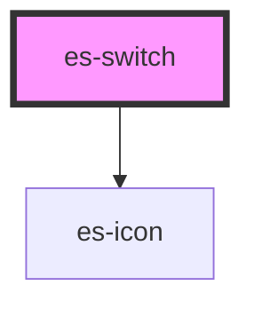

# es-switch


<!-- Auto Generated Below -->


## Usage

### Example

```tsx
import { createValidatedForm } from '@eventstore/forms';

interface Example {
    good: boolean;
}

const form = createValidatedForm<Example>({
    good: false,
});

export default () => (
    <>
        <es-switch label={'Text'} {...form.connect('good')} />
    </>
);
```

```css
:host {
    display: flex;
    flex-direction: column;
    align-items: center;
    justify-content: center;
}
```


## Properties

| Property             | Attribute       | Description                                               | Type                                                    | Default                     |
| -------------------- | --------------- | --------------------------------------------------------- | ------------------------------------------------------- | --------------------------- |
| `activeIcon`         | `active-icon`   | Icon to display when switch is on in high contrast mode.  | `[namespace: string \| symbol, name: string] \| string` | `[ICON_NAMESPACE, 'check']` |
| `activeText`         | `active-text`   | Text to display when switch is on in high contrast mode.  | `string`                                                | `'On'`                      |
| `disabled`           | `disabled`      | If the field is disabled.                                 | `boolean \| undefined`                                  | `undefined`                 |
| `inactiveIcon`       | `inactive-icon` | Icon to display when switch is off in high contrast mode. | `[namespace: string \| symbol, name: string] \| string` | `[ICON_NAMESPACE, 'check']` |
| `inactiveText`       | `inactive-text` | Text to display when switch is off in high contrast mode. | `string`                                                | `'Off'`                     |
| `invalid`            | `invalid`       | If the field is currently in an error state.              | `boolean \| undefined`                                  | `undefined`                 |
| `name` _(required)_  | `name`          | The name of the field.                                    | `string`                                                | `undefined`                 |
| `readonly`           | `readonly`      | If the field is editable.                                 | `boolean \| undefined`                                  | `undefined`                 |
| `value` _(required)_ | `value`         | The current value of the field.                           | `boolean`                                               | `undefined`                 |


## Events

| Event         | Description                                     | Type                                |
| ------------- | ----------------------------------------------- | ----------------------------------- |
| `fieldchange` | Emitted when the value of the field is changed. | `CustomEvent<FieldChange<boolean>>` |


## Methods

### `setPending(pending: boolean) => Promise<void>`

Allows you to pause interaction with the input while an operation completes.

#### Returns

Type: `Promise<void>`


## Dependencies

### Depends on

- es-icon

### Graph


----------------------------------------------


