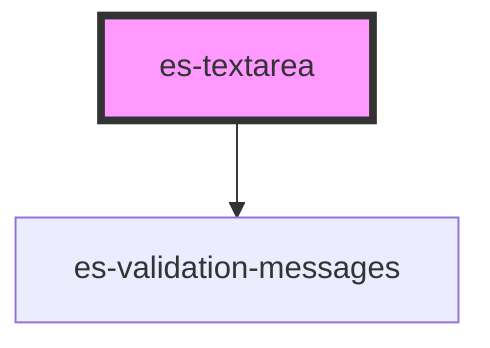

# es-textarea


<!-- Auto Generated Below -->


## Usage

### Example

```tsx
import { createWorkingData } from '@eventstore/fields';

interface Example {
    text: string;
}

const workingData = createWorkingData<Example>({
    text: '',
});

export default () => (
    <>
        <es-textarea
            label={'Text'}
            placeholder={'Write some text'}
            {...workingData.connect('text')}
        />
    </>
);
```

```css
:host {
    display: flex;
    flex-direction: column;
    align-items: center;
    justify-content: center;
}
```


## Properties

| Property                   | Attribute     | Description                                  | Type                                                                   | Default     |
| -------------------------- | ------------- | -------------------------------------------- | ---------------------------------------------------------------------- | ----------- |
| `disabled`                 | `disabled`    | If the field is disabled.                    | `boolean \| undefined`                                                 | `undefined` |
| `inputProps`               | --            | Pass props directly to the input.            | `undefined \| { [x: string]: any; }`                                   | `undefined` |
| `invalid`                  | `invalid`     | If the field is currently in an error state. | `boolean \| undefined`                                                 | `undefined` |
| `label` _(required)_       | `label`       | The label of the field.                      | `string`                                                               | `undefined` |
| `messages`                 | --            | The validation messages of the field         | `undefined \| { error: string[]; warning: string[]; info: string[]; }` | `undefined` |
| `name` _(required)_        | `name`        | The name of the field.                       | `string`                                                               | `undefined` |
| `placeholder` _(required)_ | `placeholder` | The placeholder for the input.               | `string`                                                               | `undefined` |
| `readonly`                 | `readonly`    | If the field is editable.                    | `boolean \| undefined`                                                 | `undefined` |
| `value` _(required)_       | `value`       | The current value of the field.              | `string`                                                               | `undefined` |


## Events

| Event         | Description                                     | Type               |
| ------------- | ----------------------------------------------- | ------------------ |
| `fieldchange` | Emitted when the value of the field is changed. | `CustomEvent<any>` |


## CSS Custom Properties

| Name                   | Description       |
| ---------------------- | ----------------- |
| `--field-grid-columns` | The field layout. |


## Dependencies

### Depends on

- [es-validation-messages](../es-validation-messages)

### Graph


----------------------------------------------


