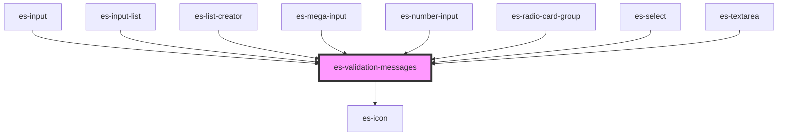

# es-validation-messages


<!-- Auto Generated Below -->


## Usage

### Example

```tsx
export default () => (
    <es-validation-messages
        messages={{
            error: ['Oh no!'],
            warning: ['Watch out!', "It's hot!"],
            info: ['It will cool down soon.'],
        }}
    />
);
```


## Properties

| Property    | Attribute    | Description                       | Type                                                                                                             | Default     |
| ----------- | ------------ | --------------------------------- | ---------------------------------------------------------------------------------------------------------------- | ----------- |
| `messages`  | --           | The messages to display.          | `undefined \| { error?: string[] \| undefined; warning?: string[] \| undefined; info?: string[] \| undefined; }` | `undefined` |
| `showIcons` | `show-icons` | Display icons alongside messages. | `boolean`                                                                                                        | `false`     |


## Dependencies

### Used by

 - [es-input](../es-input)
 - [es-input-list](../es-input-list)
 - [es-list-creator](../es-list-creator)
 - [es-mega-input](../es-mega-input)
 - [es-number-input](../es-number-input)
 - [es-radio-card-group](../es-radio-card-group)
 - [es-select](../es-select)
 - [es-textarea](../es-textarea)

### Depends on

- es-icon

### Graph


----------------------------------------------


