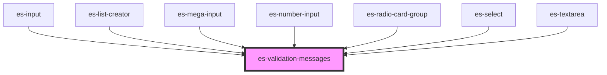

# es-validation-messages

<!-- Auto Generated Below -->

## Properties

| Property   | Attribute | Description | Type                                                                                                             | Default     |
| ---------- | --------- | ----------- | ---------------------------------------------------------------------------------------------------------------- | ----------- |
| `messages` | --        |             | `undefined \| { error?: string[] \| undefined; warning?: string[] \| undefined; info?: string[] \| undefined; }` | `undefined` |

## Dependencies

### Used by

 - [es-input](../es-input)
 - [es-list-creator](../es-list-creator)
 - [es-mega-input](../es-mega-input)
 - [es-number-input](../es-number-input)
 - [es-radio-card-group](../es-radio-card-group)
 - [es-select](../es-select)
 - [es-textarea](../es-textarea)

### Graph

----------------------------------------------

*Built with [StencilJS](https://stenciljs.com/)*
