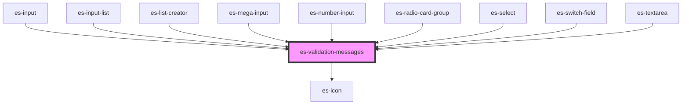

# es-validation-messages


<!-- Auto Generated Below -->


## Overview

Display messages under fields.

## Usage

### Example

```tsx
export default () => (
    <es-validation-messages
        messages={{
            error: ['Oh no!'],
            warning: ['Watch out!', "It's hot!"],
            info: [
                'It will cool down soon.',
                (h) => <es-button>{'hello'}</es-button>,
            ],
        }}
    />
);
```


## Properties

| Property      | Attribute      | Description                                                        | Type                                                                                                                                                                                                                             | Default                       |
| ------------- | -------------- | ------------------------------------------------------------------ | -------------------------------------------------------------------------------------------------------------------------------------------------------------------------------------------------------------------------------- | ----------------------------- |
| `errorIcon`   | `error-icon`   | Icon to diplay next to errors. (if `showIcons` or high contrast)   | `[namespace: string \| symbol, name: string] \| string`                                                                                                                                                                          | `[ICON_NAMESPACE, 'error']`   |
| `infoIcon`    | `info-icon`    | Icon to diplay next to infos. (if `showIcons` or high contrast)    | `[namespace: string \| symbol, name: string] \| string`                                                                                                                                                                          | `[ICON_NAMESPACE, 'info']`    |
| `messages`    | --             | The messages to display.                                           | `undefined \| { error?: ValidationMessage[] \| undefined; warning?: ValidationMessage[] \| undefined; info?: ValidationMessage[] \| undefined; children?: Record<number, Record<Severity, ValidationMessage[]>> \| undefined; }` | `undefined`                   |
| `showIcons`   | `show-icons`   | Display icons alongside messages.                                  | `boolean`                                                                                                                                                                                                                        | `false`                       |
| `warningIcon` | `warning-icon` | Icon to diplay next to warnings. (if `showIcons` or high contrast) | `[namespace: string \| symbol, name: string] \| string`                                                                                                                                                                          | `[ICON_NAMESPACE, 'warning']` |


## Dependencies

### Used by

 - [es-input](../es-input)
 - [es-input-list](../es-input-list)
 - [es-list-creator](../es-list-creator)
 - [es-mega-input](../es-mega-input)
 - [es-number-input](../es-number-input)
 - [es-radio-card-group](../es-radio-card-group)
 - [es-select](../es-select)
 - [es-switch-field](../es-switch-field)
 - [es-textarea](../es-textarea)

### Depends on

- es-icon

### Graph


----------------------------------------------


