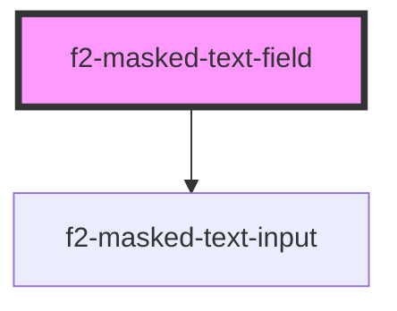

# f2-masked-text-field

<!-- Auto Generated Below -->


## Overview

A masked text input.

## Usage

### Example

```tsx
import { createValidatedForm } from '@eventstore-ui/forms';

interface Example {
    something: string;
    somethingElse: string;
}

const form = createValidatedForm<Example>({
    something: '',
    somethingElse: '',
});

const handleSubmit = (e: Event) => {
    e.preventDefault();
    form.submit((data) => {
        console.log(data);
    });
};

export default () => (
    <f2-form onSubmit={handleSubmit}>
        <f2-masked-text-field
            label={'Something'}
            documentation={'Allows you to mask the text in an input'}
            mask={{ mask: '{#}000[aaa]/NIC-`*[**]' }}
            placeholder={'Something here'}
            {...form.connect('something')}
        />
        <f2-masked-text-field
            label={'Something else'}
            documentation={'Allows you to mask the text in an input'}
            mask={{
                mask: 'Ple\\ase fill ye\\ar: 19YY',
                lazy: false,
                blocks: {
                    YY: {
                        mask: '00',
                    },
                },
            }}
            placeholder={'Something else here please'}
            {...form.connect('somethingElse')}
        />
        <es-button type={'submit'}>{'submit'}</es-button>
    </f2-form>
);
```


## Properties

| Property                   | Attribute                 | Description                              | Type                                 | Default     |
| -------------------------- | ------------------------- | ---------------------------------------- | ------------------------------------ | ----------- |
| `disabled`                 | `disabled`                | If the input is disabled.                | `boolean \| undefined`               | `undefined` |
| `documentation`            | `documentation`           | Inline documentation text.               | `string \| undefined`                | `undefined` |
| `documentationLink`        | `documentation-link`      | Inline documentation link.               | `string \| undefined`                | `undefined` |
| `documentationLinkText`    | `documentation-link-text` | Inline documentation link text.          | `string \| undefined`                | `undefined` |
| `inputProps`               | --                        | Pass props directly to the input.        | `undefined \| { [x: string]: any; }` | `undefined` |
| `invalid`                  | `invalid`                 | If the field is currently invalid.       | `boolean \| undefined`               | `undefined` |
| `label` _(required)_       | `label`                   | The label of the field.                  | `string`                             | `undefined` |
| `mask` _(required)_        | --                        | Apply an input mask                      | `MaskOptions`                        | `undefined` |
| `messages`                 | --                        | The messages to display under the field. | `ValidationMessages \| undefined`    | `undefined` |
| `name` _(required)_        | `name`                    | The name of the input.                   | `string`                             | `undefined` |
| `placeholder` _(required)_ | `placeholder`             | The placeholder for the input.           | `string`                             | `undefined` |
| `readonly`                 | `readonly`                | If the input is editable.                | `boolean \| undefined`               | `undefined` |
| `templated`                | `templated`               | If the field is templated.               | `"no-edit" \| boolean \| undefined`  | `undefined` |
| `value` _(required)_       | `value`                   | The current value of the field.          | `string`                             | `undefined` |


## Events

| Event         | Description                                              | Type                                       |
| ------------- | -------------------------------------------------------- | ------------------------------------------ |
| `enter`       | Emitted on keyup of enter, if no modifier keys are held. | `CustomEvent<any>`                         |
| `fieldchange` | Emitted when the value of the field is changed.          | `CustomEvent<FieldChange<string, string>>` |
| `requestEdit` | Emitted when the user requests to edit.                  | `CustomEvent<string>`                      |


## Dependencies

### Depends on

- [f2-masked-text-input](../input)

### Graph


----------------------------------------------


