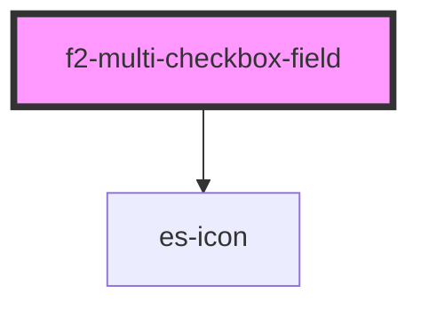

# es-multi-checkbox

<!-- Auto Generated Below -->


## Overview

A multi-checkbox component

## Usage

### Example

```tsx
import { createValidatedForm } from '@eventstore-ui/forms';

interface Example {
    options: Set<string>;
}

const form = createValidatedForm<Example>({
    options: new Set<string>(),
});

export default () => (
    <f2-multi-checkbox-field
        label={'options'}
        documentation={'Here you can select your options.'}
        options={[
            { name: 'Option 1', value: 'option1' },
            { name: 'Option 2', value: 'option2' },
            { name: 'Option 4', value: 'option4' },
            { name: 'Option 5', value: 'option5' },
            { name: 'Option 6', value: 'option6' },
            { name: 'Option 7', value: 'option7' },
            { name: 'Option 8', value: 'option8' },
            { name: 'Option 9', value: 'option9' },
            { name: 'Option 10', value: 'option10' },
            { name: 'Option 11', value: 'option11' },
            { name: 'Option 12', value: 'option12' },
            { name: 'Option 14', value: 'option14' },
            { name: 'Option 15', value: 'option15' },
            { name: 'Option 16', value: 'option16' },
            { name: 'Option 17', value: 'option17' },
            { name: 'Option 18', value: 'option18' },
            { name: 'Option 19', value: 'option19' },
        ]}
        {...form.connect('options')}
    />
);
```


## Properties

| Property                | Attribute                 | Description                              | Type                                                    | Default                     |
| ----------------------- | ------------------------- | ---------------------------------------- | ------------------------------------------------------- | --------------------------- |
| `disabled`              | `disabled`                | If the field is disabled.                | `boolean \| undefined`                                  | `undefined`                 |
| `documentation`         | `documentation`           | Inline documentation text.               | `string \| undefined`                                   | `undefined`                 |
| `documentationLink`     | `documentation-link`      | Inline documentation link.               | `string \| undefined`                                   | `undefined`                 |
| `documentationLinkText` | `documentation-link-text` | Inline documentation link text.          | `string \| undefined`                                   | `undefined`                 |
| `icon`                  | `icon`                    | The icon to use.                         | `[namespace: string \| symbol, name: string] \| string` | `[ICON_NAMESPACE, 'check']` |
| `invalid`               | `invalid`                 | If the field is currently invalid.       | `boolean \| undefined`                                  | `undefined`                 |
| `label` _(required)_    | `label`                   | The label of the field.                  | `string`                                                | `undefined`                 |
| `messages`              | --                        | The messages to display under the field. | `ValidationMessages \| undefined`                       | `undefined`                 |
| `name` _(required)_     | `name`                    | The name of the field.                   | `string`                                                | `undefined`                 |
| `options` _(required)_  | --                        | The list of options for the checkboxes.  | `MultiCheckboxOption[]`                                 | `undefined`                 |
| `readonly`              | `readonly`                | If the field is editable.                | `boolean \| undefined`                                  | `undefined`                 |
| `templated`             | `templated`               | If the field is templated.               | `"no-edit" \| boolean \| undefined`                     | `undefined`                 |
| `value` _(required)_    | --                        | The current value of the field.          | `Set<string>`                                           | `undefined`                 |


## Events

| Event         | Description                                     | Type                                            |
| ------------- | ----------------------------------------------- | ----------------------------------------------- |
| `fieldchange` | Emitted when the value of the field is changed. | `CustomEvent<FieldChange<Set<string>, string>>` |
| `requestEdit` | Emitted when the user requests to edit.         | `CustomEvent<string>`                           |


## Shadow Parts

| Part               | Description     |
| ------------------ | --------------- |
| `"checkbox-field"` | Checkbox Field. |


## Dependencies

### Depends on

- es-icon

### Graph


----------------------------------------------


