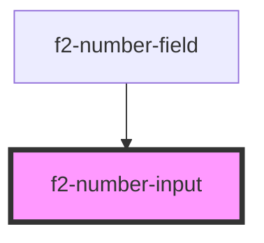

# f2-number-input

<!-- Auto Generated Below -->


## Overview

A number based input.
Values should be passed around as strings, as numbers can round / floating point / overflow etc if a number type is used.

## Usage

### Example

```tsx
import { createValidatedForm } from '@kurrent-ui/forms';

interface Example {
    count: string;
    mice: string;
}

const form = createValidatedForm<Example>({
    count: '',
    mice: {
        initialValue: '',
        validations: [
            {
                validator: (v) => parseInt(v, 10) >= 5,
                message: 'There are at least 5 mice.',
            },
        ],
    },
});

export default () => (
    <f2-form>
        <f2-number-input
            placeholder={'How high can you count'}
            unit={'n'}
            {...form.connect('count')}
        />
        <f2-number-input
            placeholder={'Are there any?'}
            unit={'🐁'}
            {...form.connect('mice')}
        />
        <es-button
            onClick={() => {
                form.submit((data) => {
                    console.log(data);
                });
            }}
        >
            {'Submit'}
        </es-button>
    </f2-form>
);
```

```css
:host {
    display: flex;
    flex-direction: column;
    align-items: center;
    justify-content: center;
}

es-button {
    margin-left: auto;
}
```


## Properties

| Property             | Attribute     | Description                                  | Type                                 | Default     |
| -------------------- | ------------- | -------------------------------------------- | ------------------------------------ | ----------- |
| `disabled`           | `disabled`    | If the field is disabled.                    | `boolean \| undefined`               | `undefined` |
| `inputProps`         | --            | Pass props directly to the input.            | `undefined \| { [x: string]: any; }` | `undefined` |
| `invalid`            | `invalid`     | If the field is currently in an error state. | `boolean \| undefined`               | `undefined` |
| `name` _(required)_  | `name`        | The name of the field.                       | `string`                             | `undefined` |
| `placeholder`        | `placeholder` | The placeholder for the input.               | `string \| undefined`                | `undefined` |
| `readonly`           | `readonly`    | If the field is editable.                    | `boolean \| undefined`               | `undefined` |
| `unit`               | `unit`        | Display a unit beside the input.             | `string \| undefined`                | `undefined` |
| `value` _(required)_ | `value`       | The current value of the field.              | `string`                             | `undefined` |


## Events

| Event         | Description                                              | Type                                       |
| ------------- | -------------------------------------------------------- | ------------------------------------------ |
| `enter`       | Emitted on keyup of enter, if no modifier keys are held. | `CustomEvent<any>`                         |
| `fieldchange` | Emitted when the value of the field is changed.          | `CustomEvent<FieldChange<string, string>>` |


## Shadow Parts

| Part     | Description        |
| -------- | ------------------ |
| `"unit"` | The unit indicator |


## Dependencies

### Used by

 - [f2-number-field](../field)

### Graph


----------------------------------------------


