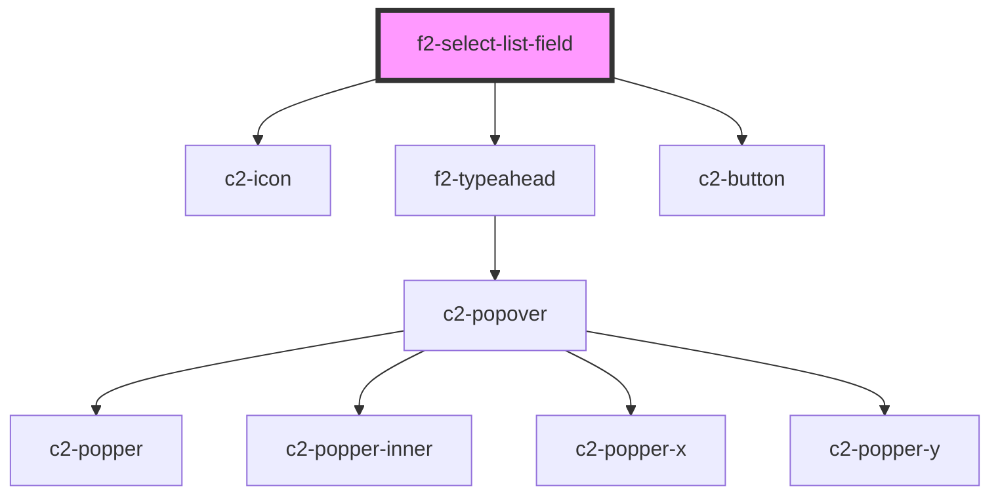

# es-list-creator

<!-- Auto Generated Below -->


## Overview

Create a list from a fixed set of values.

## Usage

### Example

```tsx
import { createValidatedForm } from '@kurrent-ui/forms';

interface Example {
    names: string[];
}

const workingData = createValidatedForm<Example>({
    names: {
        initialValue: ['john'],
    },
});

const options = [
    { name: 'John', value: 'john' },
    { name: 'Nathanial', value: 'nathanial' },
];

export default () => (
    <f2-select-list-field
        label={'Names'}
        documentation={'Add some names to your list'}
        placeholder={'Type here to filter the names'}
        options={options}
        {...workingData.connect('names')}
    />
);
```


## Properties

| Property                   | Attribute                 | Description                              | Type                                                                           | Default                                                                                                 |
| -------------------------- | ------------------------- | ---------------------------------------- | ------------------------------------------------------------------------------ | ------------------------------------------------------------------------------------------------------- |
| `addIcon`                  | `add-icon`                | The icon to display next to the field    | `[namespace: string \| symbol, name: string] \| string`                        | `[ICON_NAMESPACE, 'plus']`                                                                              |
| `chevronIcon`              | `chevron-icon`            | Icon to use as a chevron.                | `[namespace: string \| symbol, name: string] \| string`                        | `[ICON_NAMESPACE, 'chevron']`                                                                           |
| `deleteIcon`               | `delete-icon`             | Icon for the delete button.              | `[namespace: string \| symbol, name: string] \| string`                        | `[ICON_NAMESPACE, 'trash']`                                                                             |
| `disabled`                 | `disabled`                | If the field is disabled.                | `boolean \| undefined`                                                         | `undefined`                                                                                             |
| `documentation`            | `documentation`           | Inline documentation text.               | `string \| undefined`                                                          | `undefined`                                                                                             |
| `documentationLink`        | `documentation-link`      | Inline documentation link.               | `string \| undefined`                                                          | `undefined`                                                                                             |
| `documentationLinkText`    | `documentation-link-text` | Inline documentation link text.          | `string \| undefined`                                                          | `undefined`                                                                                             |
| `icon`                     | `icon`                    | The icon to display next to the field    | `[namespace: string \| symbol, name: string] \| string \| undefined`           | `undefined`                                                                                             |
| `inputProps`               | --                        | Pass props directly to the input.        | `undefined \| { [x: string]: any; }`                                           | `undefined`                                                                                             |
| `invalid`                  | `invalid`                 | If the field is currently invalid.       | `boolean \| undefined`                                                         | `undefined`                                                                                             |
| `label` _(required)_       | `label`                   | The label of the field.                  | `string`                                                                       | `undefined`                                                                                             |
| `messages`                 | --                        | The messages to display under the field. | `ValidationMessages \| undefined`                                              | `undefined`                                                                                             |
| `name` _(required)_        | `name`                    | The name of the field.                   | `string`                                                                       | `undefined`                                                                                             |
| `options` _(required)_     | --                        | A list of options to choose from.        | `TypeaheadOption[]`                                                            | `undefined`                                                                                             |
| `placeholder` _(required)_ | `placeholder`             | The placeholder for the input.           | `string`                                                                       | `undefined`                                                                                             |
| `renderItem`               | --                        | Render the list item.                    | `(h: typeof h, option: TypeaheadOption) => string \| VNode \| VNode[] \| null` | `(         h,         { name },     ) => <input readonly class={'value'} value={name} tabindex={-1} />` |
| `templated`                | `templated`               | If the field is templated.               | `"no-edit" \| boolean \| undefined`                                            | `undefined`                                                                                             |
| `value` _(required)_       | --                        | The selected item ids                    | `string[]`                                                                     | `undefined`                                                                                             |


## Events

| Event         | Description                                     | Type                                         |
| ------------- | ----------------------------------------------- | -------------------------------------------- |
| `fieldchange` | Emitted when the value of the field is changed. | `CustomEvent<FieldChange<string[], string>>` |
| `requestEdit` | Emitted when the user requests to edit.         | `CustomEvent<string>`                        |


## Shadow Parts

| Part                | Description                              |
| ------------------- | ---------------------------------------- |
| `"input"`           | The wrapping div of the select input.    |
| `"true_input"`      | The input element.                       |
| `"value-list"`      | Target the ul containing the list items. |
| `"value-list-item"` | Target the li containing the option,     |


## Dependencies

### Depends on

- c2-icon
- f2-typeahead
- c2-button

### Graph


----------------------------------------------


