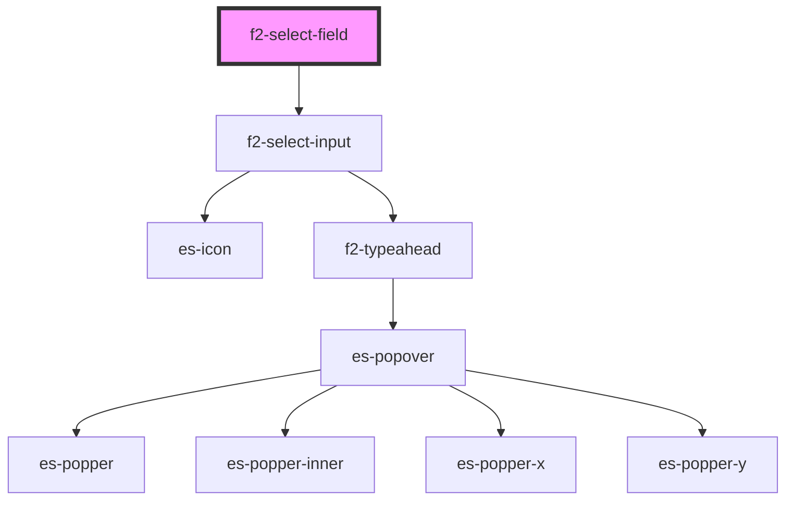

# f2-text-field

<!-- Auto Generated Below -->


## Overview

A text input.

## Usage

### Example

```tsx
import { createValidatedForm } from '@kurrent-ui/forms';

interface Example {
    name: string | null;
}

const form = createValidatedForm<Example>({
    name: null,
});

const options = [
    { name: 'Jim', value: 'jim' },
    { name: 'John', value: 'john' },
    { name: 'Nathanial', value: 'nathanial' },
];

export default () => (
    <f2-form>
        <f2-select-field
            label={'Choose a name from the list'}
            documentation={"It doesn't matter who it is."}
            placeholder={'Choose a name from the list'}
            options={options}
            {...form.connect('name')}
        />
        <f2-select-field
            disabled
            label={'Choose a name from the list'}
            documentation={'This field is disabled'}
            placeholder={'Choose a name from the list'}
            options={options}
            {...form.connect('name')}
        />
    </f2-form>
);
```


## Properties

| Property                | Attribute                 | Description                              | Type                                                                                               | Default     |
| ----------------------- | ------------------------- | ---------------------------------------- | -------------------------------------------------------------------------------------------------- | ----------- |
| `chevronIcon`           | `chevron-icon`            | Icon to use as a chevron.                | `[namespace: string \| symbol, name: string] \| string \| undefined`                               | `undefined` |
| `disabled`              | `disabled`                | If the field is disabled.                | `boolean \| undefined`                                                                             | `undefined` |
| `documentation`         | `documentation`           | Inline documentation text.               | `string \| undefined`                                                                              | `undefined` |
| `documentationLink`     | `documentation-link`      | Inline documentation link.               | `string \| undefined`                                                                              | `undefined` |
| `documentationLinkText` | `documentation-link-text` | Inline documentation link text.          | `string \| undefined`                                                                              | `undefined` |
| `inputProps`            | --                        | Pass props directly to the input.        | `undefined \| { [x: string]: any; }`                                                               | `undefined` |
| `invalid`               | `invalid`                 | If the field is currently invalid.       | `boolean \| undefined`                                                                             | `undefined` |
| `label` _(required)_    | `label`                   | The label of the field.                  | `string`                                                                                           | `undefined` |
| `messages`              | --                        | The messages to display under the field. | `ValidationMessages \| undefined`                                                                  | `undefined` |
| `name` _(required)_     | `name`                    | The name of the field.                   | `string`                                                                                           | `undefined` |
| `optionFilter`          | --                        | Pass a custom search filter function     | `((filter: string, option: TypeaheadOption) => boolean) \| undefined`                              | `undefined` |
| `options` _(required)_  | --                        | A list of options to choose from.        | `TypeaheadOption[]`                                                                                | `undefined` |
| `placeholder`           | `placeholder`             | The placeholder for the input.           | `string \| undefined`                                                                              | `undefined` |
| `readonly`              | `readonly`                | If the field is editable.                | `boolean \| undefined`                                                                             | `undefined` |
| `renderOption`          | --                        | Overwrite the default option renderer.   | `((h: typeof h, option: any, chosen: boolean) => string \| VNode \| VNode[] \| null) \| undefined` | `undefined` |
| `renderValue`           | --                        | Overwrite the default value renderer.    | `((h: typeof h, value: any, rawValue: string) => string \| VNode \| VNode[] \| null) \| undefined` | `undefined` |
| `templated`             | `templated`               | If the field is templated.               | `"no-edit" \| boolean \| undefined`                                                                | `undefined` |
| `value` _(required)_    | `value`                   | The current value of the field.          | `null \| string`                                                                                   | `undefined` |


## Events

| Event         | Description                                              | Type                                       |
| ------------- | -------------------------------------------------------- | ------------------------------------------ |
| `enter`       | Emitted on keyup of enter, if no modifier keys are held. | `CustomEvent<any>`                         |
| `fieldchange` | Emitted when the value of the field is changed.          | `CustomEvent<FieldChange<string, string>>` |
| `requestEdit` | Emitted when the user requests to edit.                  | `CustomEvent<string>`                      |


## Dependencies

### Depends on

- [f2-select-input](../input)

### Graph


----------------------------------------------


