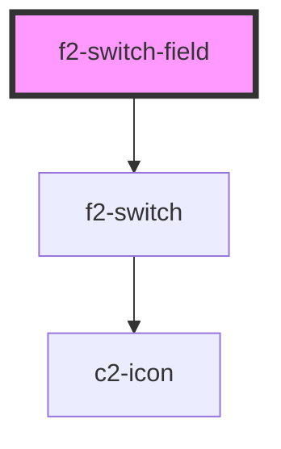

# f2-text-field

<!-- Auto Generated Below -->


## Overview

A switch with a label.

## Usage

### Example

```tsx
import { createValidatedForm } from '@kurrent-ui/forms';

interface Example {
    name: string | null;
}

const form = createValidatedForm<Example>({
    name: null,
});

const options = [
    { name: 'Jim', value: 'jim' },
    { name: 'John', value: 'john' },
    { name: 'Nathanial', value: 'nathanial' },
];

export default () => (
    <f2-form>
        <f2-select-field
            label={'Choose a name from the list'}
            documentation={"It doesn't matter who it is."}
            placeholder={'Choose a name from the list'}
            options={options}
            {...form.connect('name')}
        />
        <f2-select-field
            disabled
            label={'Choose a name from the list'}
            documentation={'This field is disabled'}
            placeholder={'Choose a name from the list'}
            options={options}
            {...form.connect('name')}
        />
    </f2-form>
);
```


## Properties

| Property                | Attribute                 | Description                                               | Type                                                    | Default                     |
| ----------------------- | ------------------------- | --------------------------------------------------------- | ------------------------------------------------------- | --------------------------- |
| `activeIcon`            | `active-icon`             | Icon to display when switch is on in high contrast mode.  | `[namespace: string \| symbol, name: string] \| string` | `[ICON_NAMESPACE, 'check']` |
| `activeText`            | `active-text`             | Text to display when switch is on in high contrast mode.  | `string`                                                | `'On'`                      |
| `disabled`              | `disabled`                | If the field is disabled.                                 | `boolean \| undefined`                                  | `undefined`                 |
| `documentation`         | `documentation`           | Inline documentation text.                                | `string \| undefined`                                   | `undefined`                 |
| `documentationLink`     | `documentation-link`      | Inline documentation link.                                | `string \| undefined`                                   | `undefined`                 |
| `documentationLinkText` | `documentation-link-text` | Inline documentation link text.                           | `string \| undefined`                                   | `undefined`                 |
| `inactiveIcon`          | `inactive-icon`           | Icon to display when switch is off in high contrast mode. | `[namespace: string \| symbol, name: string] \| string` | `[ICON_NAMESPACE, 'check']` |
| `inactiveText`          | `inactive-text`           | Text to display when switch is off in high contrast mode. | `string`                                                | `'Off'`                     |
| `invalid`               | `invalid`                 | If the field is currently invalid.                        | `boolean \| undefined`                                  | `undefined`                 |
| `label` _(required)_    | `label`                   | The label of the field.                                   | `string`                                                | `undefined`                 |
| `messages`              | --                        | The messages to display under the field.                  | `ValidationMessages \| undefined`                       | `undefined`                 |
| `name` _(required)_     | `name`                    | The name of the field.                                    | `string`                                                | `undefined`                 |
| `readonly`              | `readonly`                | If the field is editable.                                 | `boolean \| undefined`                                  | `undefined`                 |
| `templated`             | `templated`               | If the field is templated.                                | `"no-edit" \| boolean \| undefined`                     | `undefined`                 |
| `value` _(required)_    | `value`                   | The current value of the field.                           | `boolean`                                               | `undefined`                 |


## Events

| Event         | Description                                              | Type                                       |
| ------------- | -------------------------------------------------------- | ------------------------------------------ |
| `enter`       | Emitted on keyup of enter, if no modifier keys are held. | `CustomEvent<any>`                         |
| `fieldchange` | Emitted when the value of the field is changed.          | `CustomEvent<FieldChange<string, string>>` |
| `requestEdit` | Emitted when the user requests to edit.                  | `CustomEvent<string>`                      |


## Shadow Parts

| Part      | Description    |
| --------- | -------------- |
| `"inner"` | The inner div. |


## Dependencies

### Depends on

- [f2-switch](../input)

### Graph


----------------------------------------------


