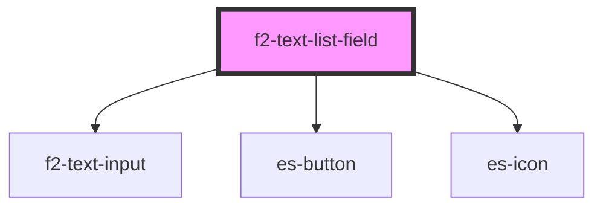

# es-list-creator

<!-- Auto Generated Below -->


## Overview

A list creator input.

## Usage

### Example

```tsx
import { createValidatedForm } from '@eventstore-ui/forms';

interface Example {
    names: string[];
}

const form = createValidatedForm<Example>({
    names: {
        initialValue: ['John', ''],
    },
});

export default () => (
    <es-input-list
        label={'Names'}
        placeholder={'Add a name to your list'}
        {...form.connect('names')}
    />
);
```

```css
:host {
    display: flex;
    flex-direction: column;
    align-items: center;
    justify-content: center;
}
```


## Properties

| Property                   | Attribute                 | Description                              | Type                                                    | Default                     |
| -------------------------- | ------------------------- | ---------------------------------------- | ------------------------------------------------------- | --------------------------- |
| `additionIcon`             | `addition-icon`           | Icon for the add item button.            | `[namespace: string \| symbol, name: string] \| string` | `[ICON_NAMESPACE, 'plus']`  |
| `additionText`             | `addition-text`           | Text for the add item button.            | `string`                                                | `'Add item'`                |
| `deleteIcon`               | `delete-icon`             | Icon for the delete button.              | `[namespace: string \| symbol, name: string] \| string` | `[ICON_NAMESPACE, 'trash']` |
| `disabled`                 | `disabled`                | If the input is disabled.                | `boolean \| undefined`                                  | `undefined`                 |
| `documentation`            | `documentation`           | Inline documentation text.               | `string \| undefined`                                   | `undefined`                 |
| `documentationLink`        | `documentation-link`      | Inline documentation link.               | `string \| undefined`                                   | `undefined`                 |
| `documentationLinkText`    | `documentation-link-text` | Inline documentation link text.          | `string \| undefined`                                   | `undefined`                 |
| `invalid`                  | `invalid`                 | If the field is currently invalid.       | `boolean \| undefined`                                  | `undefined`                 |
| `label` _(required)_       | `label`                   | The label of the field.                  | `string`                                                | `undefined`                 |
| `messages`                 | --                        | The messages to display under the field. | `ValidationMessages \| undefined`                       | `undefined`                 |
| `name` _(required)_        | `name`                    | The name of the field.                   | `string`                                                | `undefined`                 |
| `placeholder` _(required)_ | `placeholder`             | Display a placeholder in the input.      | `string`                                                | `undefined`                 |
| `templated`                | `templated`               | If the field is templated.               | `"no-edit" \| boolean \| undefined`                     | `undefined`                 |
| `value` _(required)_       | --                        | The currently selected values            | `string[]`                                              | `undefined`                 |


## Events

| Event         | Description                                     | Type                                         |
| ------------- | ----------------------------------------------- | -------------------------------------------- |
| `fieldchange` | Emitted when the value of the field is changed. | `CustomEvent<FieldChange<string[], string>>` |
| `requestEdit` | Emitted when the user requests to edit.         | `CustomEvent<string>`                        |


## Dependencies

### Depends on

- [f2-text-input](../text/input)
- es-button
- es-icon

### Graph


----------------------------------------------


