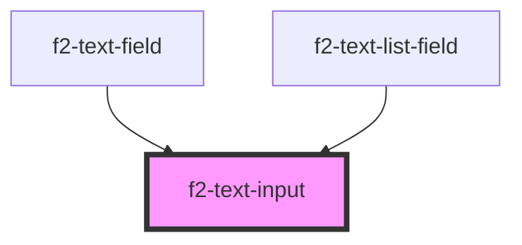

# f2-text-input


<!-- Auto Generated Below -->


## Overview

A text input.

## Usage

### Example

```tsx
import { createValidatedForm } from '@eventstore-ui/forms';

interface Example {
    something: string;
    somethingElse: string;
}

const form = createValidatedForm<Example>({
    something: '',
    somethingElse: '',
});

const handleSubmit = (e: Event) => {
    e.preventDefault();
    form.submit((data) => {
        console.log(data);
    });
};

export default () => (
    <f2-form onSubmit={handleSubmit}>
        <f2-text-input
            placeholder={'Something Else'}
            {...form.connect('somethingElse')}
        />
        <f2-text-input
            placeholder={'Something'}
            {...form.connect('something')}
        />
        <es-button type={'submit'}>{'submit'}</es-button>
    </f2-form>
);
```


## Properties

| Property                   | Attribute     | Description                        | Type                                 | Default     |
| -------------------------- | ------------- | ---------------------------------- | ------------------------------------ | ----------- |
| `disabled`                 | `disabled`    | If the input is disabled.          | `boolean \| undefined`               | `undefined` |
| `inputProps`               | --            | Pass props directly to the input.  | `undefined \| { [x: string]: any; }` | `undefined` |
| `invalid`                  | `invalid`     | If the input is currently invalid. | `boolean \| undefined`               | `undefined` |
| `name` _(required)_        | `name`        | The name of the input.             | `string`                             | `undefined` |
| `placeholder` _(required)_ | `placeholder` | The placeholder for the input.     | `string`                             | `undefined` |
| `readonly`                 | `readonly`    | If the input is editable.          | `boolean \| undefined`               | `undefined` |
| `value` _(required)_       | `value`       | The current value of the field.    | `string`                             | `undefined` |


## Events

| Event         | Description                                              | Type                                       |
| ------------- | -------------------------------------------------------- | ------------------------------------------ |
| `enter`       | Emitted on keyup of enter, if no modifier keys are held. | `CustomEvent<any>`                         |
| `fieldchange` | Emitted when the value of the field is changed.          | `CustomEvent<FieldChange<string, string>>` |


## Dependencies

### Used by

 - [f2-text-field](../field)
 - [f2-text-list-field](../../text-list)

### Graph


----------------------------------------------


