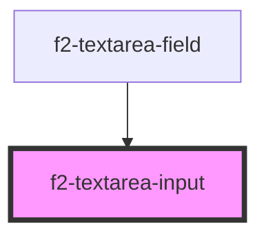

# es-textarea

<!-- Auto Generated Below -->

## Overview

A textarea input.

## Usage

### Example

```tsx
import { createValidatedForm } from '@kurrent-ui/forms';

interface Example {
    text: string;
}

const form = createValidatedForm<Example>({
    text: '',
});

export default () => (
    <>
        <es-textarea
            label={'Text'}
            placeholder={'Write some text'}
            {...form.connect('text')}
        />
    </>
);
```

```css
:host {
    display: flex;
    flex-direction: column;
    align-items: center;
    justify-content: center;
}
```

## Properties

| Property                   | Attribute     | Description                                  | Type                                 | Default     |
| -------------------------- | ------------- | -------------------------------------------- | ------------------------------------ | ----------- |
| `disabled`                 | `disabled`    | If the input is disabled.                    | `boolean \| undefined`               | `undefined` |
| `inputProps`               | --            | Pass props directly to the input.            | `undefined \| { [x: string]: any; }` | `undefined` |
| `invalid`                  | `invalid`     | If the input is currently in an error state. | `boolean \| undefined`               | `undefined` |
| `name` _(required)_        | `name`        | The name of the input.                       | `string`                             | `undefined` |
| `placeholder` _(required)_ | `placeholder` | The placeholder for the input.               | `string`                             | `undefined` |
| `readonly`                 | `readonly`    | If the input is editable.                    | `boolean \| undefined`               | `undefined` |
| `value` _(required)_       | `value`       | The current value of the input.              | `string`                             | `undefined` |

## Events

| Event         | Description                                     | Type                                       |
| ------------- | ----------------------------------------------- | ------------------------------------------ |
| `fieldchange` | Emitted when the value of the field is changed. | `CustomEvent<FieldChange<string, string>>` |

## Dependencies

### Used by

-   [f2-textarea-field](.)

### Graph



---
