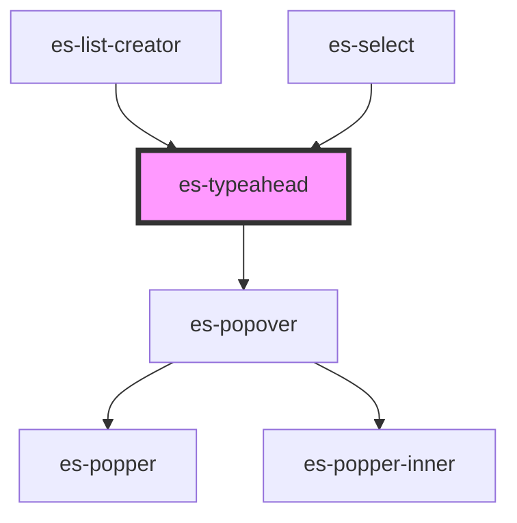

# es-typeahead

<!-- Auto Generated Below -->

## Usage

### Example

```tsx
import { createWorkingData } from '@kurrent-ui/fields';

interface Example {
    text: string;
    id: string;
}

const workingData = createWorkingData<Example>({
    text: '',
    id: {
        initialValue: '',
        validations: [
            {
                validator: (v) => v.length === 12,
                message: 'Please provide a complete Id',
            },
        ],
    },
});

const onEnter = () => {
    workingData.submit((data) => {
        console.log(data);
    });
};

export default () => (
    <>
        <es-input
            label={'Text'}
            placeholder={'Write some text'}
            onEnter={onEnter}
            {...workingData.connect('text')}
        />
        <es-input
            label={'Account Id'}
            onEnter={onEnter}
            mask={{
                mask: '0000-0000-0000',
                unmask: true,
                lazy: false,
                placeholderChar: '_',
            }}
            {...workingData.connect('id')}
        />
    </>
);
```

```css
:host {
    display: flex;
    flex-direction: column;
    align-items: center;
    justify-content: center;
}
```

## Properties

| Property                   | Attribute         | Description | Type                                                                       | Default                                                                                 |
| -------------------------- | ----------------- | ----------- | -------------------------------------------------------------------------- | --------------------------------------------------------------------------------------- |
| `clearOnSelect`            | `clear-on-select` |             | `boolean`                                                                  | `false`                                                                                 |
| `closeOnSelect`            | `close-on-select` |             | `boolean`                                                                  | `false`                                                                                 |
| `disabled`                 | `disabled`        |             | `boolean \| undefined`                                                     | `undefined`                                                                             |
| `name` _(required)_        | `name`            |             | `string`                                                                   | `undefined`                                                                             |
| `optionFilter`             | --                |             | `(filter: string, option: TypeaheadOption) => boolean`                     | `(f, { name }) => {         return name.toLowerCase().includes(f.toLowerCase());     }` |
| `options` _(required)_     | --                |             | `TypeaheadOption[]`                                                        | `undefined`                                                                             |
| `readonly`                 | `readonly`        |             | `boolean \| undefined`                                                     | `undefined`                                                                             |
| `renderField` _(required)_ | --                |             | `(params: RenderTypeaheadFieldParams) => VNode \| VNode[]`                 | `undefined`                                                                             |
| `renderOption`             | --                |             | `(option: TypeaheadOption, chosen: boolean) => string \| VNode \| VNode[]` | `({ name }) => name`                                                                    |
| `value` _(required)_       | --                |             | `string[]`                                                                 | `undefined`                                                                             |

## Events

| Event         | Description | Type               |
| ------------- | ----------- | ------------------ |
| `enter`       |             | `CustomEvent<any>` |
| `fieldchange` |             | `CustomEvent<any>` |

## Shadow Parts

| Part       | Description |
| ---------- | ----------- |
| `"list"`   |             |
| `"option"` |             |

## Dependencies

### Used by

-   [es-list-creator](../es-list-creator)
-   [es-select](../es-select)

### Depends on

-   es-popover

### Graph



---
