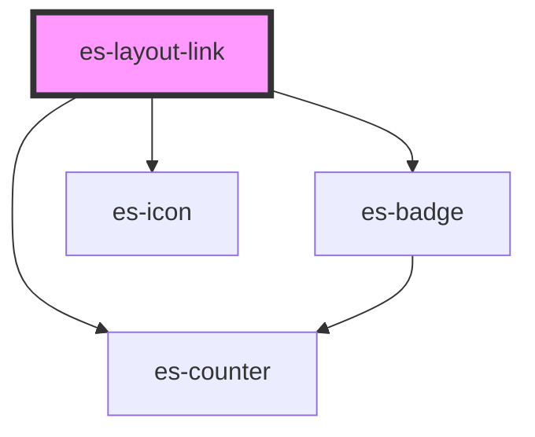

# docs-sidebar-link

<!-- Auto Generated Below -->


## Overview

A link for the sidebar, sidebar-dropdown, and header-dropdown.

## Usage

### Example

```tsx
import { randomIcon } from 'utils/helpers';

export default () => (
    <es-sidebar>
        <es-layout-section sectionTitle={'Links'}>
            <es-layout-link url={'/no-icon-1'}>{'Example link'}</es-layout-link>
            <es-layout-link url={'/preview'}>{'I am active'}</es-layout-link>
            <es-layout-link url={'/no-icon-1'}>{'Example link'}</es-layout-link>
            <es-layout-link disabled url={'/no-icon-2'}>
                {'Disabled example  '}
            </es-layout-link>
        </es-layout-section>
        <es-layout-section sectionTitle={'With Icon'}>
            <es-layout-link url={'/icon-1'} icon={randomIcon()}>
                {'With Icon'}
            </es-layout-link>
            <es-layout-link disabled url={'/icon-2'} icon={randomIcon()}>
                {'Disabled'}
            </es-layout-link>
            <es-layout-link url={'/icon-1'} icon={randomIcon()}>
                {'Another'}
            </es-layout-link>
            <es-layout-link url={'/icon-1'} icon={randomIcon()}>
                {'More Icon'}
            </es-layout-link>
        </es-layout-section>
        <es-layout-section sectionTitle={'Alert levels'}>
            <es-layout-link
                alertLevel={'error'}
                url={'/icon-1'}
                icon={randomIcon()}
            >
                {'Error'}
            </es-layout-link>
            <es-layout-link
                alertLevel={'warning'}
                url={'/icon-1'}
                icon={randomIcon()}
            >
                {'Warning'}
            </es-layout-link>
            <es-layout-link
                alertLevel={'okay'}
                url={'/icon-1'}
                icon={randomIcon()}
            >
                {'Okay'}
            </es-layout-link>
            <es-layout-link url={'/icon-1'} count={12}>
                {'Counter'}
            </es-layout-link>
        </es-layout-section>
        <es-layout-section sectionTitle={'Level Example'}>
            <es-layout-link url={'/icon-1'} level={1}>
                {'Level 1'}
            </es-layout-link>
            <es-layout-link url={'/icon-1'} level={1}>
                {'Level 1'}
            </es-layout-link>
            <es-layout-link url={'/icon-1'} level={2}>
                {'Level 2'}
            </es-layout-link>
            <es-layout-link url={'/icon-1'} level={2}>
                {'Level 2'}
            </es-layout-link>
            <es-layout-link url={'/icon-1'} level={1}>
                {'Level 1'}
            </es-layout-link>
            <es-layout-link url={'/icon-1'} level={2}>
                {'Level 2'}
            </es-layout-link>
            <es-layout-link url={'/icon-1'} level={3}>
                {'Level 3'}
            </es-layout-link>
            <es-layout-link url={'/icon-1'} level={3}>
                {'Level 3'}
            </es-layout-link>
            <es-layout-link url={'/icon-1'} level={1}>
                {'Level 1'}
            </es-layout-link>
        </es-layout-section>
    </es-sidebar>
);
```


## Properties

| Property       | Attribute       | Description                                                                        | Type                                                                 | Default     |
| -------------- | --------------- | ---------------------------------------------------------------------------------- | -------------------------------------------------------------------- | ----------- |
| `alertLevel`   | `alert-level`   | Display a dot on the icon, to attract attention to the link.                       | `"error" \| "okay" \| "warning" \| undefined`                        | `undefined` |
| `count`        | `count`         | Display a counter in place of the icon.                                            | `number \| undefined`                                                | `undefined` |
| `disabled`     | `disabled`      | If the link should be disabled.                                                    | `boolean`                                                            | `false`     |
| `external`     | `external`      | If the link is external                                                            | `boolean \| undefined`                                               | `undefined` |
| `forceRefresh` | `force-refresh` | If the Link should break out of the router, and force a page load                  | `boolean \| undefined`                                               | `undefined` |
| `icon`         | `icon`          | Display an icon on the left.                                                       | `[namespace: string \| symbol, name: string] \| string \| undefined` | `undefined` |
| `level`        | `level`         | Apply an indent to the left of the link, for basic nesting.                        | `number \| undefined`                                                | `undefined` |
| `matchExact`   | `match-exact`   | Use exact url matching for active.                                                 | `boolean \| undefined`                                               | `undefined` |
| `matchStrict`  | `match-strict`  | Use strict url matching for active.                                                | `boolean \| undefined`                                               | `undefined` |
| `matchUrl`     | `match-url`     | When to display as active. Uses the `url` by default.                              | `string \| undefined`                                                | `undefined` |
| `priority`     | `priority`      | When deciding the active child, if multiple are active, the highest priority wins. | `number`                                                             | `0`         |
| `target`       | `target`        | Target for link (eg: target="_blank")                                              | `string \| undefined`                                                | `undefined` |
| `url`          | `url`           | Where to link to.                                                                  | `string \| undefined`                                                | `undefined` |


## Methods

### `isActive() => Promise<boolean>`

If the link is currently active

#### Returns

Type: `Promise<boolean>`


## Shadow Parts

| Part        | Description         |
| ----------- | ------------------- |
| `"counter"` | The counter element |
| `"link"`    | The link element.   |


## Dependencies

### Depends on

- es-counter
- es-badge
- es-icon

### Graph


----------------------------------------------


