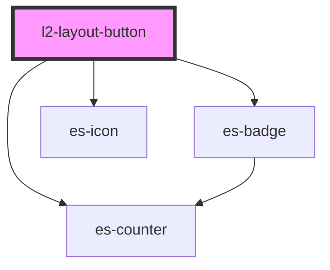

# docs-sidebar-link

<!-- Auto Generated Below -->


## Overview

A button for the sidebar, sidebar-dropdown, and header-dropdown.

## Usage

### Example

```tsx
import { randomIcon } from 'utils/helpers';

export default () => (
    <l2-sidebar>
        <l2-layout-section sectionTitle={'Buttons'}>
            <l2-layout-button onClick={console.log}>
                {'Example button'}
            </l2-layout-button>
            <l2-layout-button active onClick={console.log}>
                {'I am active'}
            </l2-layout-button>
            <l2-layout-button onClick={console.log}>
                {'Example button'}
            </l2-layout-button>
            <l2-layout-button disabled onClick={console.log}>
                {'Disabled example  '}
            </l2-layout-button>
        </l2-layout-section>
        <l2-layout-section sectionTitle={'With Icon'}>
            <l2-layout-button onClick={console.log} icon={randomIcon()}>
                {'With Icon'}
            </l2-layout-button>
            <l2-layout-button
                disabled
                onClick={console.log}
                icon={randomIcon()}
            >
                {'Disabled'}
            </l2-layout-button>
            <l2-layout-button onClick={console.log} icon={randomIcon()}>
                {'Another'}
            </l2-layout-button>
            <l2-layout-button onClick={console.log} icon={randomIcon()}>
                {'More Icon'}
            </l2-layout-button>
        </l2-layout-section>
        <l2-layout-section sectionTitle={'Alert levels'}>
            <l2-layout-button
                alertLevel={'error'}
                onClick={console.log}
                icon={randomIcon()}
            >
                {'Error'}
            </l2-layout-button>
            <l2-layout-button
                alertLevel={'warning'}
                onClick={console.log}
                icon={randomIcon()}
            >
                {'Warning'}
            </l2-layout-button>
            <l2-layout-button
                alertLevel={'okay'}
                onClick={console.log}
                icon={randomIcon()}
            >
                {'Okay'}
            </l2-layout-button>
            <l2-layout-button onClick={console.log} count={12}>
                {'Counter'}
            </l2-layout-button>
        </l2-layout-section>
        <l2-layout-section sectionTitle={'Level Example'}>
            <l2-layout-button onClick={console.log} level={1}>
                {'Level 1'}
            </l2-layout-button>
            <l2-layout-button onClick={console.log} level={1}>
                {'Level 1'}
            </l2-layout-button>
            <l2-layout-button onClick={console.log} level={2}>
                {'Level 2'}
            </l2-layout-button>
            <l2-layout-button onClick={console.log} level={2}>
                {'Level 2'}
            </l2-layout-button>
            <l2-layout-button onClick={console.log} level={1}>
                {'Level 1'}
            </l2-layout-button>
            <l2-layout-button onClick={console.log} level={2}>
                {'Level 2'}
            </l2-layout-button>
            <l2-layout-button onClick={console.log} level={3}>
                {'Level 3'}
            </l2-layout-button>
            <l2-layout-button onClick={console.log} level={3}>
                {'Level 3'}
            </l2-layout-button>
            <l2-layout-button onClick={console.log} level={1}>
                {'Level 1'}
            </l2-layout-button>
        </l2-layout-section>
    </l2-sidebar>
);
```


## Properties

| Property       | Attribute        | Description                                                                        | Type                                                                 | Default     |
| -------------- | ---------------- | ---------------------------------------------------------------------------------- | -------------------------------------------------------------------- | ----------- |
| `active`       | `active`         | If the button should display as active                                             | `boolean`                                                            | `false`     |
| `alertLevel`   | `alert-level`    | Display a dot on the icon, to attract attention to the button.                     | `"error" \| "okay" \| "warning" \| undefined`                        | `undefined` |
| `closeOnClick` | `close-on-click` | If the parent popup should close when clicked.                                     | `boolean`                                                            | `false`     |
| `count`        | `count`          | Display a counter in place of the icon.                                            | `number \| undefined`                                                | `undefined` |
| `disabled`     | `disabled`       | If the button should be disabled.                                                  | `boolean`                                                            | `false`     |
| `icon`         | `icon`           | Display an icon on the left.                                                       | `[namespace: string \| symbol, name: string] \| string \| undefined` | `undefined` |
| `level`        | `level`          | Apply an indent to the left of the button, for basic nesting.                      | `number \| undefined`                                                | `undefined` |
| `priority`     | `priority`       | When deciding the active child, if multiple are active, the highest priority wins. | `number`                                                             | `0`         |


## Events

| Event          | Description                         | Type               |
| -------------- | ----------------------------------- | ------------------ |
| `requestClose` | Triggers the parent popup to close. | `CustomEvent<any>` |


## Methods

### `isActive() => Promise<boolean>`

If the button is currently active

#### Returns

Type: `Promise<boolean>`


## Shadow Parts

| Part        | Description                       |
| ----------- | --------------------------------- |
| `"badge"`   | The badge element, if rendered.   |
| `"button"`  | The button element.               |
| `"counter"` | The counter element, if rendered. |
| `"icon"`    | The icon element, if rendered.    |


## Dependencies

### Depends on

- es-counter
- es-badge
- es-icon

### Graph


----------------------------------------------


