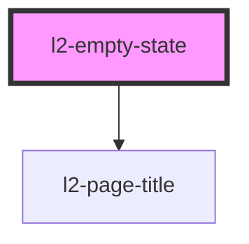

# l2-empty-state

<!-- Auto Generated Below -->


## Overview

Display an empty state with an illustration and a message.
Intended for use as `Page`'s `renderEmptyState`.

## Usage

### Example

```tsx
export default () => (
    <l2-empty-state header={'Create a new group'}>
        <kurrent-sequence slot={'illustration'} />
        {
            'Creating a new group will allow for the grouping of members with the same access.'
        }
        <c2-button slot={'foot'} variant={'outline'}>
            {'New group'}
            <c2-icon icon={'plus'} slot={'after'} />
        </c2-button>
    </l2-empty-state>
);
```


## Properties

| Property              | Attribute | Description                    | Type                         | Default      |
| --------------------- | --------- | ------------------------------ | ---------------------------- | ------------ |
| `header` _(required)_ | `header`  | The header of the empty state. | `string`                     | `undefined`  |
| `layout`              | `layout`  | The layout of the empty state. | `"horizontal" \| "vertical"` | `'vertical'` |


## Slots

| Slot             | Description                    |
| ---------------- | ------------------------------ |
| `"foot"`         | The footer content to display. |
| `"illustration"` | The illustration to display.   |


## Shadow Parts

| Part      | Description                            |
| --------- | -------------------------------------- |
| `"body"`  | The body of the empty state.           |
| `"inner"` | The container of the empty state.      |
| `"text"`  | The text container of the empty state. |
| `"title"` | The title of the empty state.          |


## Dependencies

### Depends on

- [l2-page-title](../page-title)

### Graph


----------------------------------------------


