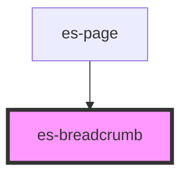

# es-breadcrumb

<!-- Auto Generated Below -->

## Properties

| Property     | Attribute     | Description | Type      | Default |
| ------------ | ------------- | ----------- | --------- | ------- |
| `crumbs`     | --            |             | `Crumb[]` | `[]`    |
| `noValidate` | `no-validate` |             | `boolean` | `false` |

## Dependencies

### Used by

 - [es-page](../es-page)

### Graph

----------------------------------------------

