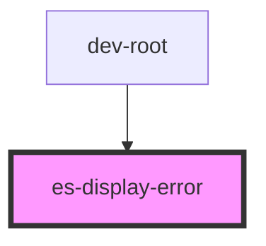

# es-display-error


<!-- Auto Generated Below -->


## Usage

### Example

```tsx
const error = new Error("Oh no! It's all gone wrong.");

export default () => (
    <es-display-error error={error}>
        <es-button>{'Do something else'}</es-button>
    </es-display-error>
);
```


## Properties

| Property  | Attribute | Description                                                                                                                                                               | Type                               | Default     |
| --------- | --------- | ------------------------------------------------------------------------------------------------------------------------------------------------------------------------- | ---------------------------------- | ----------- |
| `error`   | --        | The unrecoverable error. For a normal error, error.message will be displayed. For a `HTTPError` from `@eventstore/utils` the details title and description will be shown. | `unknown`                          | `undefined` |
| `variant` | `variant` | Which styling variant to use.                                                                                                                                             | `"landscape" \| "page" \| "small"` | `'page'`    |


## Slots

| Slot             | Description                              |
| ---------------- | ---------------------------------------- |
| `"illustration"` | Replace the illustration for your error. |


## Dependencies

### Used by

 - dev-root

### Graph


----------------------------------------------


