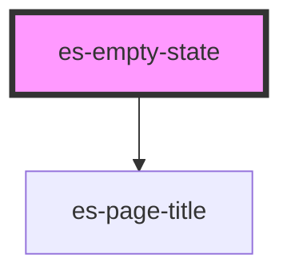

# es-empty-state


<!-- Auto Generated Below -->


## Overview

Display an empty state with an illustration and a message.
Intended for use as `Page`'s `renderEmptyState`.

## Usage

### Example

```tsx

export default () =>
<div>
    <es-empty-state header={'Example empty state'} body={<es-button>{'There are no items'}</es-button>}>
    <es-illustration-group slot={'illustration'} />
    <p slot='foot'>{ 'Footer goes here' }</p>
    </es-empty-state>
    <hr/>
    <es-empty-state header={'Example empty state'} body={'No items to show'} layout='horizontal'>
    <es-illustration-group slot={'illustration'} />
    <p slot='foot'>{ 'Footer goes here' }</p>
    </es-empty-state>
</div>
        
```


## Properties

| Property              | Attribute | Description                    | Type                         | Default      |
| --------------------- | --------- | ------------------------------ | ---------------------------- | ------------ |
| `header` _(required)_ | `header`  | The header of the empty state. | `string`                     | `undefined`  |
| `layout`              | `layout`  | The layout of the empty state. | `"horizontal" \| "vertical"` | `'vertical'` |


## Slots

| Slot             | Description                    |
| ---------------- | ------------------------------ |
| `"foot"`         | The footer content to display. |
| `"illustration"` | The illustration to display.   |


## Shadow Parts

| Part      | Description                            |
| --------- | -------------------------------------- |
| `"body"`  | The body of the empty state.           |
| `"inner"` | The container of the empty state.      |
| `"text"`  | The text container of the empty state. |
| `"title"` | The title of the empty state.          |


## Dependencies

### Depends on

- [es-page-title](../es-page-title)

### Graph


----------------------------------------------


