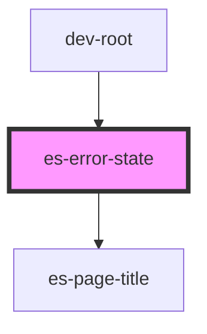

# es-error-state


<!-- Auto Generated Below -->


## Usage

### Example

```tsx
const error = new Error("Oh no! It's all gone wrong.");

export default () => (
    <es-error-state error={error}>
        <es-button>{'Do something else'}</es-button>
    </es-error-state>
);
```


## Properties

| Property             | Attribute | Description                                                                                                                                                               | Type    | Default     |
| -------------------- | --------- | ------------------------------------------------------------------------------------------------------------------------------------------------------------------------- | ------- | ----------- |
| `error` _(required)_ | --        | The unrecoverable error. For a normal error, error.message will be displayed. For a `HTTPError` from `@eventstore/utils` the details title and description will be shown. | `Error` | `undefined` |


## Slots

| Slot             | Description                            |
| ---------------- | -------------------------------------- |
| `"illustration"` | An illustration for your error screen. |


## Dependencies

### Used by

 - dev-root

### Depends on

- [es-page-title](../es-page-title)

### Graph


----------------------------------------------


